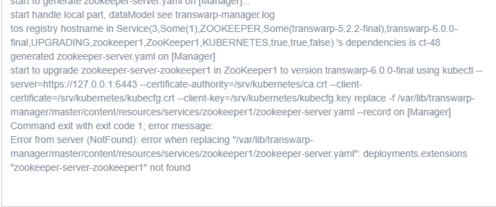
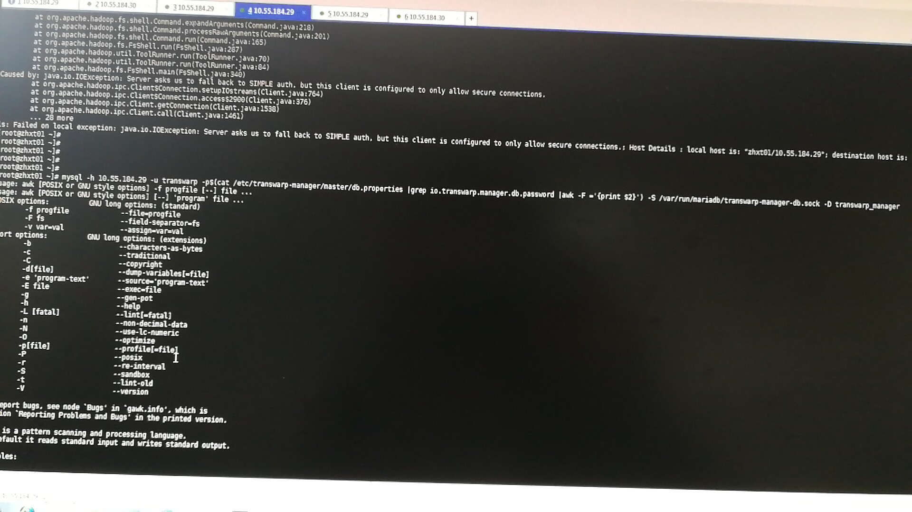

2019/04/12 11:15:39:**王宾** : 应该可以，可能某些rpm需要升级或者降级下
*************************************************************************************
2019/04/12 11:19:51:**卢国彬** : 嗯嗯 好的 谢谢~
*************************************************************************************
2019/04/12 13:14:53:**孙强** : 
*******************************************************************************
2019/04/12 13:15:23:**孙强** : 6.0.2manager升级服务失败，这是什么原因呢
*************************************************************************************
2019/04/12 13:16:42:**Leo（xinhui）** : 有几个集群
*************************************************************************************
2019/04/12 13:16:57:**孙强** : 就一个集群
*************************************************************************************
2019/04/12 13:17:11:**孙强** : manager是从522升到602的
*************************************************************************************
2019/04/12 13:18:18:**孙强** : 上传的image602的升不了，又上传6.0的image，但升级报错
*************************************************************************************
2019/04/12 14:17:48:**北卿*** : 
*******************************************************************************
2019/04/12 14:18:32:**北卿*** : 求教一个问题，客户这安全我在manager上关了，但是执行hdfs 命令报错提示有安全认证
*************************************************************************************
2019/04/12 14:19:21:**北卿*** : 我执行后台指令查看数据库想统一关闭安全，命令好像不对，有什么办法吗
*************************************************************************************
