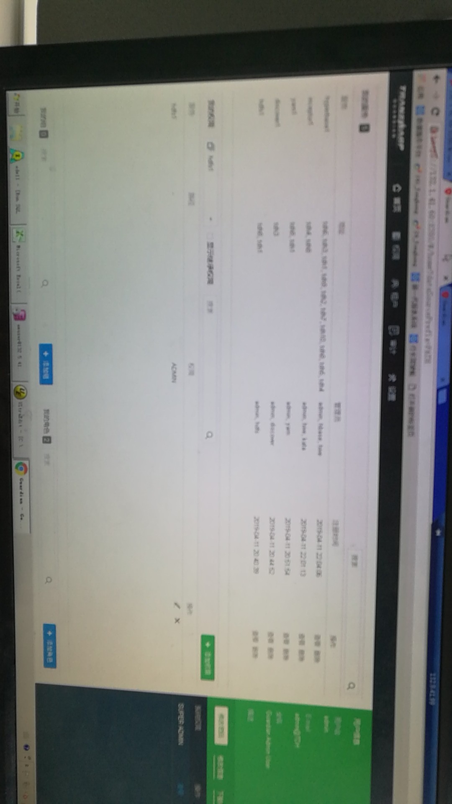
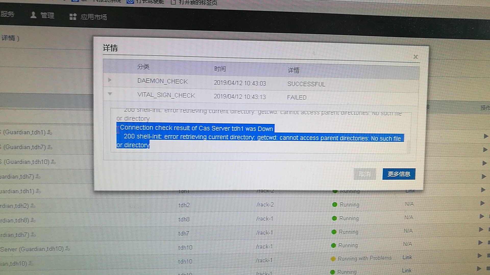
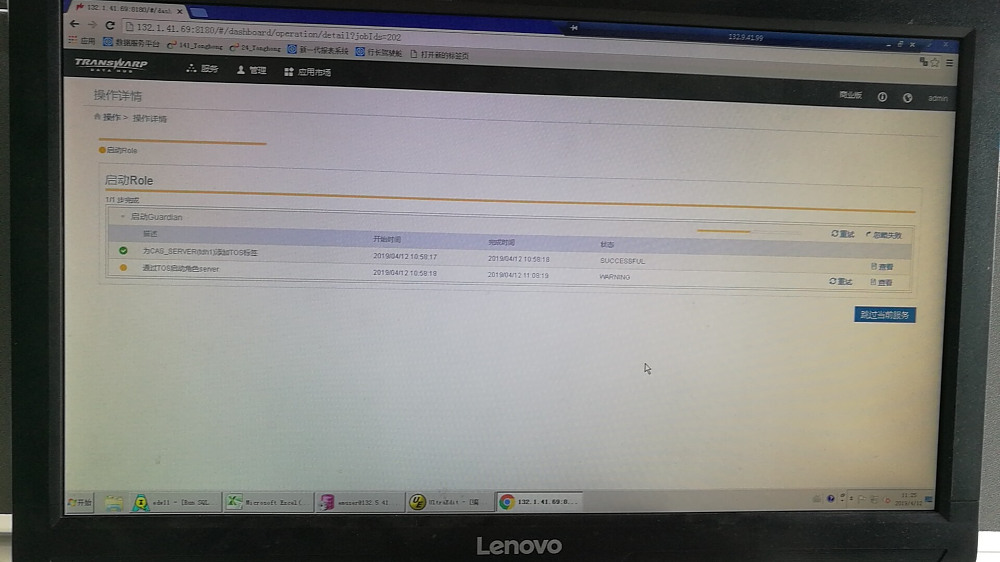
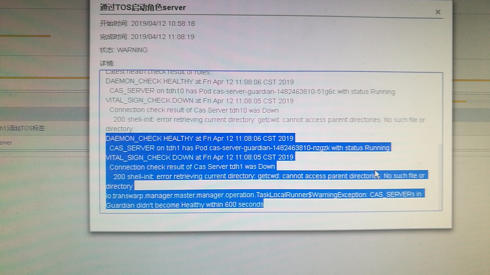
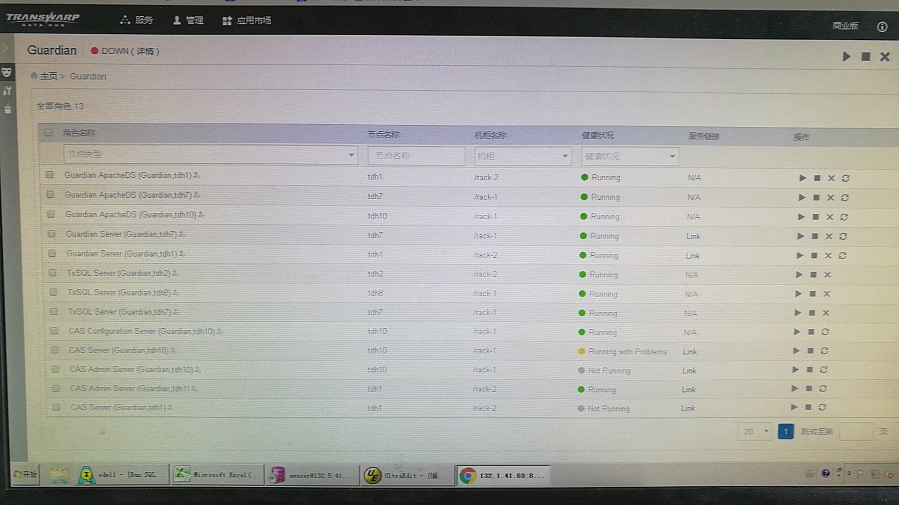
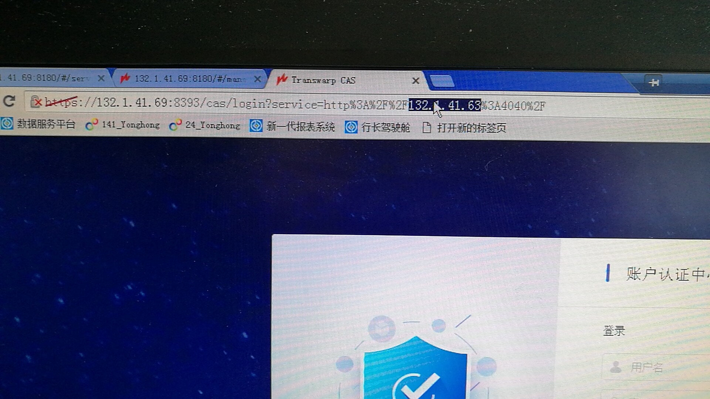
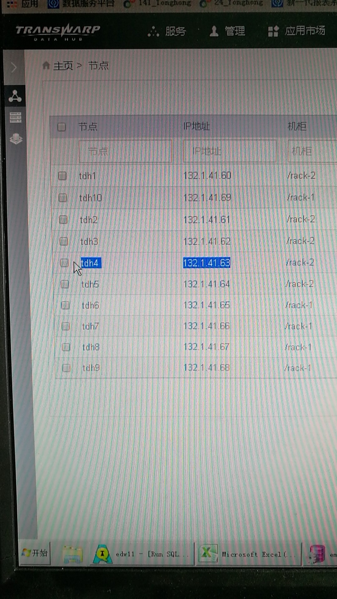
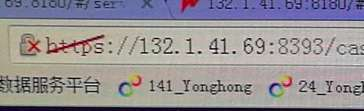

2019/04/12 10:48:24:**Ethan Koo** : 进入一下Guardian server界面，是不是ok的
*************************************************************************************
2019/04/12 10:49:15:**HMK** : 两个都是可以的
*************************************************************************************
2019/04/12 10:49:23:**HMK** : 
*******************************************************************************
2019/04/12 10:49:44:**Ethan Koo** : 那我感觉，cas没啥问题啊
*************************************************************************************
2019/04/12 10:50:01:**HMK** : 是不是安装两个CAS server ,cas admin server 的问题
*************************************************************************************
2019/04/12 10:50:16:**HMK** : 界面上显示是runnning with problem
*************************************************************************************
2019/04/12 10:50:35:**HMK** : 
*******************************************************************************
2019/04/12 10:50:38:**Ethan Koo** : 确实cas server不用装两个的，因为跳转登录的时候只能跳到一个去
*************************************************************************************
2019/04/12 10:50:58:**HMK** : 删除一个安全不？
*************************************************************************************
2019/04/12 10:51:23:**Ethan Koo** : 这个health check失败的原因我也看不懂。。。😂
*************************************************************************************
2019/04/12 10:51:37:**HMK** : CAS admin server 有必要两个吗？
*************************************************************************************
2019/04/12 10:51:46:**HMK** : 提示的是目录不存在
*************************************************************************************
2019/04/12 10:52:10:**Ethan Koo** : 也没有。。当然多装了也没关系
*************************************************************************************
2019/04/12 10:52:23:**Ethan Koo** : 其实大多数情况下用不到admin server
*************************************************************************************
2019/04/12 10:53:01:**HMK** : 那现在怎么把这个 报红去掉
*************************************************************************************
2019/04/12 10:54:55:**Ethan Koo** : 多的cas server应该可以直接删，不过为了保险起见，拉个manager的人进群再问一下吧
*************************************************************************************
2019/04/12 10:55:26:**HMK** : @太阳与冰 
*************************************************************************************
2019/04/12 10:58:58:**太阳与冰** : @何所思 
*************************************************************************************
2019/04/12 11:07:02:**何所思** : 删cas server  ？
*************************************************************************************
2019/04/12 11:08:18:**HMK** : 嗯
*************************************************************************************
2019/04/12 11:09:17:**HMK** : 可以直接删除吗？
*************************************************************************************
2019/04/12 11:09:25:**HMK** : 有什么风险？
*************************************************************************************
2019/04/12 11:09:27:**何所思** : 可以
*************************************************************************************
2019/04/12 11:13:00:**HMK** : 两个任选一个删除？
*************************************************************************************
2019/04/12 11:18:32:**HMK** : @何所思
*************************************************************************************
2019/04/12 11:18:32:**HMK** : @何所思
*************************************************************************************
2019/04/12 11:25:45:**徐恒** : 这不清楚咯
*************************************************************************************
2019/04/12 11:25:45:**何所思** : 这不清楚咯
*************************************************************************************
2019/04/12 11:25:59:**HMK** : 
*******************************************************************************
2019/04/12 11:25:59:**HMK** : 
*******************************************************************************
2019/04/12 11:26:19:**HMK** : 
*******************************************************************************
2019/04/12 11:26:19:**HMK** : 
*******************************************************************************
2019/04/12 11:26:45:**HMK** : 应该不仅仅是多一个的问题，有报错信息
*************************************************************************************
2019/04/12 11:26:45:**HMK** : 应该不仅仅是多一个的问题，有报错信息
*************************************************************************************
2019/04/12 11:27:06:**HMK** : 另外一个是停止的状态，这个启不来
*************************************************************************************
2019/04/12 11:27:06:**HMK** : 另外一个是停止的状态，这个启不来
*************************************************************************************
2019/04/12 11:27:32:**HMK** : 
*******************************************************************************
2019/04/12 11:27:32:**HMK** : 
*******************************************************************************
2019/04/12 11:28:03:**HMK** : running with probelm 但是可以打开link
*************************************************************************************
2019/04/12 11:28:03:**HMK** : running with probelm 但是可以打开link
*************************************************************************************
2019/04/12 11:28:15:**HMK** : @太阳与冰 @Ethan Koo @何所思
*************************************************************************************
2019/04/12 11:28:15:**HMK** : @太阳与冰 @Ethan Koo @何所思
*************************************************************************************
2019/04/12 11:29:48:**Ethan Koo** : 看看现在Guardian server，还有inceptor的4040页面之类的跳转到的是哪个cas，那个cas就留下来。多余的那一个删掉
*************************************************************************************
2019/04/12 11:29:48:**Ethan Koo** : 看看现在Guardian server，还有inceptor的4040页面之类的跳转到的是哪个cas，那个cas就留下来。多余的那一个删掉
*************************************************************************************
2019/04/12 11:30:14:**Ethan Koo** : 如果只剩下一个还是黄色的话，先重启一下那个角色看一下
*************************************************************************************
2019/04/12 11:30:14:**Ethan Koo** : 如果只剩下一个还是黄色的话，先重启一下那个角色看一下
*************************************************************************************
2019/04/12 11:30:37:**HMK** : 好，只能下午处理了，[捂脸]
*************************************************************************************
2019/04/12 11:30:37:**HMK** : 好，只能下午处理了，[捂脸]
*************************************************************************************
2019/04/12 11:31:17:**HMK** : cas admin server也是两个，怎么判断那个在用
*************************************************************************************
2019/04/12 11:31:17:**HMK** : cas admin server也是两个，怎么判断那个在用
*************************************************************************************
2019/04/12 11:31:47:**Ethan Koo** : 其实两个都不再用。。没有任何一个组件依赖admin server。。。。
*************************************************************************************
2019/04/12 11:31:47:**Ethan Koo** : 其实两个都不再用。。没有任何一个组件依赖admin server。。。。
*************************************************************************************
2019/04/12 11:32:17:**Ethan Koo** : 就算全部删掉了，整个集群依然能够正常工作。。所以随便保留一个就行了
*************************************************************************************
2019/04/12 11:32:17:**Ethan Koo** : 就算全部删掉了，整个集群依然能够正常工作。。所以随便保留一个就行了
*************************************************************************************
2019/04/12 11:32:37:**HMK** : 好的
*************************************************************************************
2019/04/12 11:32:37:**HMK** : 好的
*************************************************************************************
2019/04/12 14:27:25:**HMK** : 
*******************************************************************************
2019/04/12 14:27:45:**HMK** : 
*******************************************************************************
2019/04/12 14:37:24:**HMK** : cas server在tdh1 和tdh10上，感觉用的之前的版本的数据
*************************************************************************************
2019/04/12 14:37:28:**HMK** : @Ethan Koo
*************************************************************************************
2019/04/12 14:38:53:**Ethan Koo** : 现在是删掉了一个吗
*************************************************************************************
2019/04/12 14:39:20:**HMK** : 还没有敢删的
*************************************************************************************
2019/04/12 14:39:43:**HMK** : 因为用的并不是这两个
*************************************************************************************
2019/04/12 14:39:54:**Ethan Koo** : 
*******************************************************************************
2019/04/12 14:40:05:**Ethan Koo** : 4040用的是这个
*************************************************************************************
