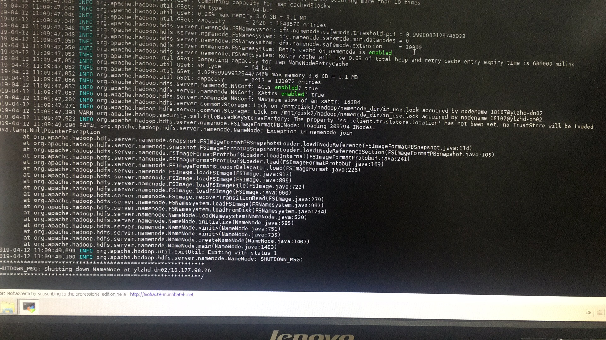
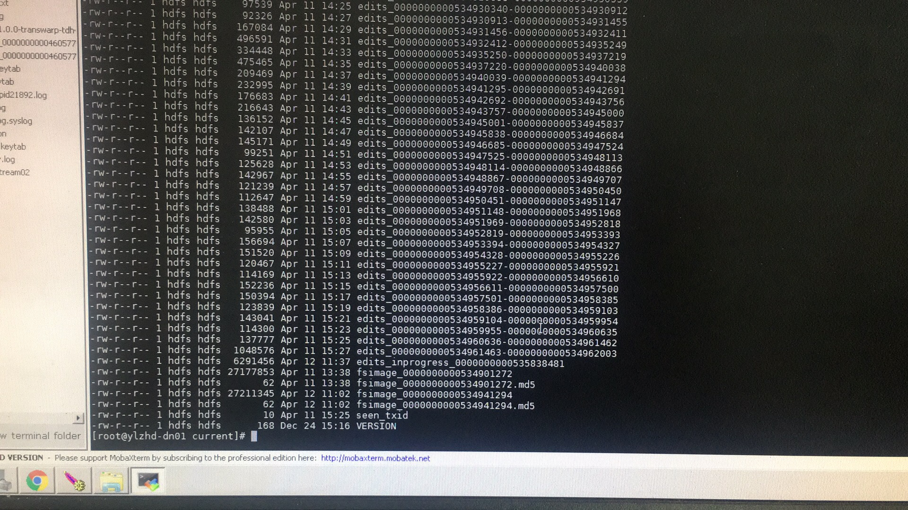
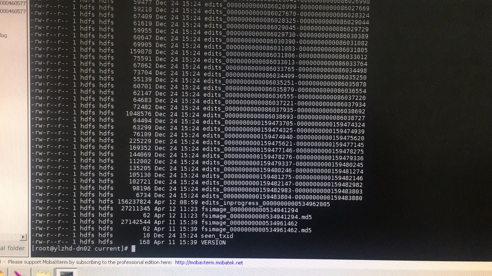

2019/04/12 10:49:03:**马文奇** : 收到
*************************************************************************************
2019/04/12 10:53:33:**马文奇** : [点我进附件](https://github.com/CorkiZhang/itchat-message/tree/master/sla1-868 hdfsnamenode起不来/ATTACHMENT/fsimage_20190412.tgz)
*******************************************************************************
2019/04/12 10:53:39:**马文奇** : 试试这个
*************************************************************************************
2019/04/12 10:54:22:**ʏɪᴄᴋᴛʏ .** : 好的
*************************************************************************************
2019/04/12 11:10:27:**ʏɪᴄᴋᴛʏ .** : @马文奇 大佬，我用你给我的替换了之后nn01是好了但是另一个namenode起不来
*************************************************************************************
2019/04/12 11:11:20:**ʏɪᴄᴋᴛʏ .** : 
*******************************************************************************
2019/04/12 11:11:56:**ʏɪᴄᴋᴛʏ .** : 显示启动成功但是实际没起来
*************************************************************************************
2019/04/12 11:16:36:**马文奇** : 这不还是刚才的错误吗？确定替换了
*************************************************************************************
2019/04/12 11:16:36:**马文奇/Hadoop** : 这不还是刚才的错误吗？确定替换了
*************************************************************************************
2019/04/12 11:18:16:**星环武桂峰** : 确认替换
*************************************************************************************
2019/04/12 11:18:16:**ʏɪᴄᴋᴛʏ .** : 确认替换
*************************************************************************************
2019/04/12 11:19:32:**马文奇/Hadoop** : 另外一个nn是好的？
*************************************************************************************
2019/04/12 11:19:32:**马文奇** : 另外一个nn是好的？
*************************************************************************************
2019/04/12 11:19:43:**星环武桂峰** : 是的
*************************************************************************************
2019/04/12 11:19:43:**ʏɪᴄᴋᴛʏ .** : 是的
*************************************************************************************
2019/04/12 11:19:54:**ʏɪᴄᴋᴛʏ .** : 我替换了01是能起来的
*************************************************************************************
2019/04/12 11:19:54:**星环武桂峰** : 我替换了01是能起来的
*************************************************************************************
2019/04/12 11:20:08:**马文奇** : 那把另外一个nn下的新fsimage拷贝过去
*************************************************************************************
2019/04/12 11:20:08:**马文奇/Hadoop** : 那把另外一个nn下的新fsimage拷贝过去
*************************************************************************************
2019/04/12 11:20:15:**星环武桂峰** : 好的
*************************************************************************************
2019/04/12 11:20:15:**ʏɪᴄᴋᴛʏ .** : 好的
*************************************************************************************
2019/04/12 11:20:29:**马文奇/Hadoop** : 01现在退出safemode了吗？
*************************************************************************************
2019/04/12 11:20:29:**马文奇** : 01现在退出safemode了吗？
*************************************************************************************
2019/04/12 11:20:57:**ʏɪᴄᴋᴛʏ .** : 退出了
*************************************************************************************
2019/04/12 11:20:57:**星环武桂峰** : 退出了
*************************************************************************************
2019/04/12 11:21:27:**马文奇/Hadoop** : 那应该生成了一个新的fsimage，把最新的拷贝过去吧
*************************************************************************************
2019/04/12 11:21:27:**马文奇** : 那应该生成了一个新的fsimage，把最新的拷贝过去吧
*************************************************************************************
2019/04/12 11:25:15:**星环武桂峰** : 还是不行
*************************************************************************************
2019/04/12 11:25:15:**ʏɪᴄᴋᴛʏ .** : 还是不行
*************************************************************************************
2019/04/12 11:34:51:**星环武桂峰** : 我看他看起来修改时间没变
*************************************************************************************
2019/04/12 11:34:51:**ʏɪᴄᴋᴛʏ .** : 我看他看起来修改时间没变
*************************************************************************************
2019/04/12 11:36:28:**ʏɪᴄᴋᴛʏ .** : 我是说那个好的
*************************************************************************************
2019/04/12 11:36:28:**星环武桂峰** : 我是说那个好的
*************************************************************************************
2019/04/12 11:37:08:**马文奇/Hadoop** : ls -l 看下
*************************************************************************************
2019/04/12 11:37:08:**马文奇** : ls -l 看下
*************************************************************************************
2019/04/12 11:37:21:**星环武桂峰** : 看那个好的还是坏的
*************************************************************************************
2019/04/12 11:37:21:**ʏɪᴄᴋᴛʏ .** : 看那个好的还是坏的
*************************************************************************************
2019/04/12 11:37:39:**马文奇** : 都看下
*************************************************************************************
2019/04/12 11:37:39:**马文奇/Hadoop** : 都看下
*************************************************************************************
2019/04/12 11:37:44:**星环武桂峰** : 
*******************************************************************************
2019/04/12 11:37:44:**ʏɪᴄᴋᴛʏ .** : 
*******************************************************************************
2019/04/12 11:38:09:**ʏɪᴄᴋᴛʏ .** : 前面那个好的
*************************************************************************************
2019/04/12 11:38:09:**星环武桂峰** : 前面那个好的
*************************************************************************************
2019/04/12 11:38:09:**ʏɪᴄᴋᴛʏ .** : 
*******************************************************************************
2019/04/12 11:38:09:**星环武桂峰** : 
*******************************************************************************
2019/04/12 11:38:16:**ʏɪᴄᴋᴛʏ .** : 这个是起不来的
*************************************************************************************
2019/04/12 11:38:16:**星环武桂峰** : 这个是起不来的
*************************************************************************************
2019/04/12 11:39:17:**马文奇/Hadoop** : 兄弟，你给我的fsimage不是最新的啊
*************************************************************************************
2019/04/12 11:39:17:**马文奇** : 兄弟，你给我的fsimage不是最新的啊
*************************************************************************************
2019/04/12 11:39:54:**马文奇** : 这个节点上的534961462明显比你给我的新啊，
*************************************************************************************
2019/04/12 11:39:54:**马文奇/Hadoop** : 这个节点上的534961462明显比你给我的新啊，
*************************************************************************************
2019/04/12 11:40:00:**马文奇** : nn会用这个啊
*************************************************************************************
2019/04/12 11:40:00:**马文奇/Hadoop** : nn会用这个啊
*************************************************************************************
2019/04/12 11:40:02:**星环武桂峰** : 我给你的是最新的啊我给的是nn01的
*************************************************************************************
2019/04/12 11:40:02:**ʏɪᴄᴋᴛʏ .** : 我给你的是最新的啊我给的是nn01的
*************************************************************************************
2019/04/12 11:40:18:**星环武桂峰** : 那这个nn02要单独修改？
*************************************************************************************
2019/04/12 11:40:18:**ʏɪᴄᴋᴛʏ .** : 那这个nn02要单独修改？
*************************************************************************************
2019/04/12 11:41:25:**马文奇/Hadoop** : 把这个新的给我吧
*************************************************************************************
2019/04/12 11:41:25:**马文奇** : 把这个新的给我吧
*************************************************************************************
2019/04/12 11:41:32:**ʏɪᴄᴋᴛʏ .** : 哪个
*************************************************************************************
2019/04/12 11:41:32:**星环武桂峰** : 哪个
*************************************************************************************
2019/04/12 11:42:00:**马文奇/Hadoop** : nn02上这个起不来的新的
*************************************************************************************
2019/04/12 11:42:00:**马文奇** : nn02上这个起不来的新的
*************************************************************************************
2019/04/12 11:42:09:**ʏɪᴄᴋᴛʏ .** : 好的
*************************************************************************************
2019/04/12 11:42:09:**星环武桂峰** : 好的
*************************************************************************************
2019/04/12 11:42:35:**ʏɪᴄᴋᴛʏ .** : 好的
*************************************************************************************
2019/04/12 11:42:35:**星环武桂峰** : 好的
*************************************************************************************
2019/04/12 11:42:36:**马文奇** : 理论上我们应该改这个然后传到两个节点上就可以了，
*************************************************************************************
2019/04/12 11:42:49:**ʏɪᴄᴋᴛʏ .** : 哦哦我懂了
*************************************************************************************
2019/04/12 11:42:49:**星环武桂峰** : 哦哦我懂了
*************************************************************************************
2019/04/12 11:42:56:**ʏɪᴄᴋᴛʏ .** : 我前面也没注意
*************************************************************************************
2019/04/12 11:42:56:**星环武桂峰** : 我前面也没注意
*************************************************************************************
2019/04/12 11:53:02:**ʏɪᴄᴋᴛʏ .** : @马文奇 请查收
*************************************************************************************
2019/04/12 11:53:02:**星环武桂峰** : @马文奇 请查收
*************************************************************************************
2019/04/12 11:53:23:**ʏɪᴄᴋᴛʏ .** : [点我进附件](https://github.com/CorkiZhang/itchat-message/tree/master/sla1-868 hdfsnamenode起不来/ATTACHMENT/nn02.tar.gz)
*******************************************************************************
2019/04/12 11:53:23:**星环武桂峰** : [点我进附件](https://github.com/CorkiZhang/itchat-message/tree/master/sla1-868 hdfsnamenode起不来/ATTACHMENT/nn02.tar.gz)
*******************************************************************************
2019/04/12 13:50:15:**马文奇/Hadoop** : [点我进附件](https://github.com/CorkiZhang/itchat-message/tree/master/sla1-868 hdfsnamenode起不来/ATTACHMENT/fsimage_20190412_2.tgz)
*******************************************************************************
2019/04/12 13:50:15:**马文奇** : [点我进附件](https://github.com/CorkiZhang/itchat-message/tree/master/sla1-868 hdfsnamenode起不来/ATTACHMENT/fsimage_20190412_2.tgz)
*******************************************************************************
2019/04/12 13:51:21:**马文奇/Hadoop** : @ʏɪᴄᴋᴛʏ . 试下
*************************************************************************************
2019/04/12 13:51:21:**马文奇** : @ʏɪᴄᴋᴛʏ . 试下
*************************************************************************************
2019/04/12 13:51:49:**ʏɪᴄᴋᴛʏ .** : 好的
*************************************************************************************
2019/04/12 13:51:49:**星环武桂峰** : 好的
*************************************************************************************
2019/04/12 13:55:24:**星环武桂峰** : 这个只替换问题节点吗
*************************************************************************************
2019/04/12 13:55:24:**ʏɪᴄᴋᴛʏ .** : 这个只替换问题节点吗
*************************************************************************************
2019/04/12 13:56:55:**马文奇/Hadoop** : 可以
*************************************************************************************
2019/04/12 13:56:55:**马文奇** : 可以
*************************************************************************************
2019/04/12 13:58:10:**ʏɪᴄᴋᴛʏ .** : 好了
*************************************************************************************
2019/04/12 13:58:10:**星环武桂峰** : 好了
*************************************************************************************
2019/04/12 13:58:13:**星环武桂峰** : 谢谢大佬支持
*************************************************************************************
2019/04/12 13:58:13:**ʏɪᴄᴋᴛʏ .** : 谢谢大佬支持
*************************************************************************************
2019/04/12 13:59:08:**ʏɪᴄᴋᴛʏ .** : 现在还处于safemode
*************************************************************************************
2019/04/12 13:59:08:**星环武桂峰** : 现在还处于safemode
*************************************************************************************
2019/04/12 14:01:28:**星环武桂峰** : 现在已经正常
*************************************************************************************
2019/04/12 14:01:28:**ʏɪᴄᴋᴛʏ .** : 现在已经正常
*************************************************************************************
2019/04/12 14:01:33:**ʏɪᴄᴋᴛʏ .** : 感谢大佬支持
*************************************************************************************
2019/04/12 14:01:33:**星环武桂峰** : 感谢大佬支持
*************************************************************************************
