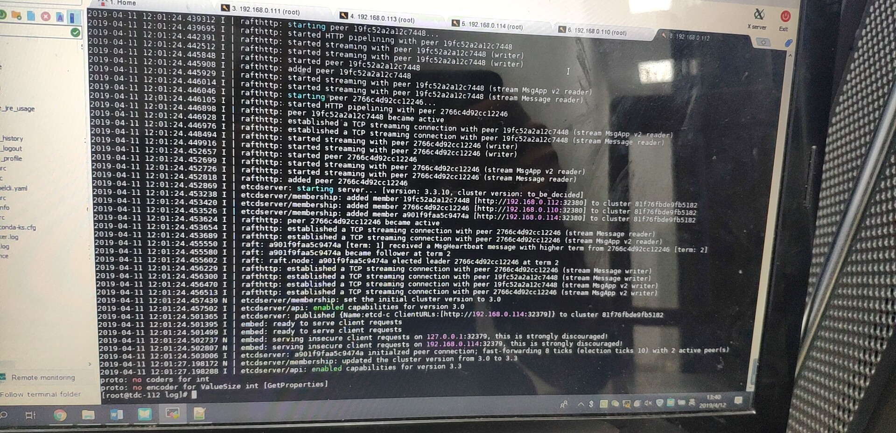
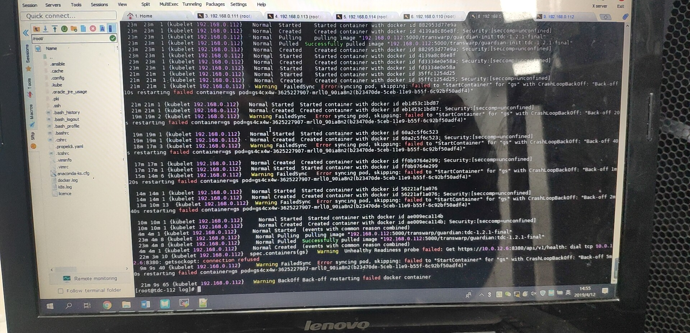
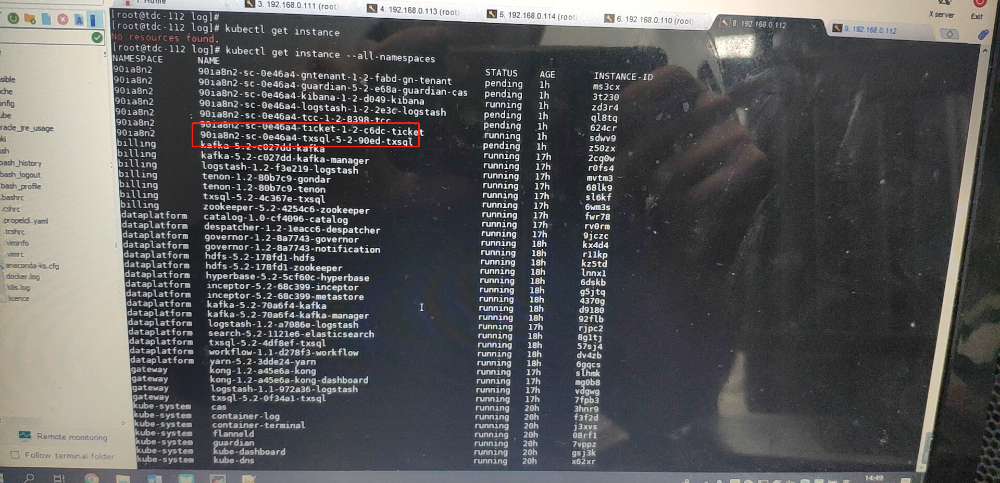

2019/04/12 13:08:48:**李健** : 
*******************************************************************************
2019/04/12 13:09:08:**太阳与冰** : 
*******************************************************************************
2019/04/12 13:09:15:**太阳与冰** : 
*******************************************************************************
2019/04/12 13:09:22:**太阳与冰** : 
*******************************************************************************
2019/04/12 13:09:29:**太阳与冰** : @Sean 
*************************************************************************************
2019/04/12 13:10:11:**Sean** : 嗯，现在这个租户一个多小时之后还是创建失败了。
*************************************************************************************
2019/04/12 13:11:09:**太阳与冰** : df -h  、 free -h 、systemctl status docker看一下
*************************************************************************************
2019/04/12 13:12:33:**Sean** : 
*******************************************************************************
2019/04/12 13:12:35:**Sean** : 
*******************************************************************************
2019/04/12 13:12:37:**Sean** : 
*******************************************************************************
2019/04/12 13:12:40:**Sean** : 
*******************************************************************************
2019/04/12 13:14:36:**Sean** : 
*******************************************************************************
2019/04/12 13:14:38:**Sean** : 
*******************************************************************************
2019/04/12 13:14:49:**Sean** : 现在新租户创建快一个小时了
*************************************************************************************
2019/04/12 13:15:57:**Sean** : 我上午最开始创建租户的时候，创建用户命名空间失败，然后参照wiki跑了下面是脚本
*************************************************************************************
2019/04/12 13:16:10:**Sean** : 
*******************************************************************************
2019/04/12 13:16:39:**Sean** : 可以创建命名空间，但是现在的情况是创建pod特别慢，不知道和这个有没有关系
*************************************************************************************
2019/04/12 13:29:22:**Anonymous** : 可以把邱维眀拉这里讨论
*************************************************************************************
2019/04/12 13:29:48:**Anonymous** : log看起来没有txsql
*************************************************************************************
2019/04/12 13:29:59:**Anonymous** : 也看看propeller日志
*************************************************************************************
2019/04/12 13:30:16:**Sean** : 对啊，用户空间里面这些pod都没有创建，所以都会有这种错误
*************************************************************************************
2019/04/12 13:31:10:**Anonymous** : txsql怎么只有一个pod
*************************************************************************************
2019/04/12 13:31:16:**Anonymous** : 进去看看能用吗？
*************************************************************************************
2019/04/12 13:32:07:**Sean** : 用户空间里面pod创建不了，很慢，现在里面没有txsql	,我这里说的慢不是pending这种状态，而是直接找不到
*************************************************************************************
2019/04/12 13:32:37:**Anonymous** : 最开始截图不是有吗
*************************************************************************************
2019/04/12 13:33:01:**Sean** : 
*******************************************************************************
2019/04/12 13:33:52:**Anonymous** : 重新创建一个看看吧
*************************************************************************************
2019/04/12 13:34:18:**Sean** : Txsql一个小时也没有出现，这些pod顺序也是乱的，多次创建租户都是一样的，这些pod不安顺序来
*************************************************************************************
2019/04/12 13:34:25:**Sean** : [捂脸]
*************************************************************************************
2019/04/12 13:34:37:**Anonymous** : pod没有顺序的吧
*************************************************************************************
2019/04/12 13:34:56:**Sean** : 对啊，但是一般情况下时间比较短看不出来
*************************************************************************************
2019/04/12 13:35:25:**Anonymous** : 重新创建
*************************************************************************************
2019/04/12 13:35:34:**Sean** : 欧克欧克
*************************************************************************************
2019/04/12 13:35:39:**Anonymous** : 然后把最新的propeller日志拿一下
*************************************************************************************
2019/04/12 13:36:52:**Anonymous** : 或者看下日志有啥错
*************************************************************************************
2019/04/12 13:37:05:**Sean** : 拉邱为民进来下，我没他好友
*************************************************************************************
2019/04/12 13:37:18:**张石胜** : "Anonymous"邀请"东风"加入了群聊
*************************************************************************************
2019/04/12 13:38:25:**Sean** : Propeller的日志在哪
*************************************************************************************
2019/04/12 13:38:46:**Sean** : <sysmsg type="revokemsg"><revokemsg><session>13369949065@chatroom</session><oldmsgid>1685955383</oldmsgid><msgid>2897945105166732783</msgid><replacemsg><![CDATA["Sean" 撤回了一条消息]]></replacemsg></revokemsg></sysmsg>
*************************************************************************************
2019/04/12 13:41:47:**Sean** : 不好意思，有点慢，我拍照片要出来一下，里面手机没信号
*************************************************************************************
2019/04/12 13:41:47:**Sean** : 
*******************************************************************************
2019/04/12 13:42:00:**Sean** : 
*******************************************************************************
2019/04/12 13:42:20:**Sean** : 
*******************************************************************************
2019/04/12 13:43:24:**Anonymous** : propeller的日志？
*************************************************************************************
2019/04/12 13:43:30:**Sean** : 嗯
*************************************************************************************
2019/04/12 13:43:51:**Anonymous** : 重启下？
*************************************************************************************
2019/04/12 13:43:56:**Sean** : kubectl logs看的 ，服务器吗
*************************************************************************************
2019/04/12 13:44:04:**Sean** : 服务器重启？
*************************************************************************************
2019/04/12 13:44:17:**Anonymous** : propeller
*************************************************************************************
2019/04/12 13:45:25:**Sean** : 嗯，等会日志我发出来
*************************************************************************************
2019/04/12 13:49:37:**Sean** : 
*******************************************************************************
2019/04/12 13:50:03:**Anonymous** : 重启完了？
*************************************************************************************
2019/04/12 13:50:07:**Sean** : 嗯
*************************************************************************************
2019/04/12 13:50:13:**Sean** : 重启完了
*************************************************************************************
2019/04/12 13:50:48:**Sean** : 和刚才报错差不多
*************************************************************************************
2019/04/12 13:51:07:**Anonymous** : propeller etcd在吗
*************************************************************************************
2019/04/12 13:51:18:**Sean** : 在的
*************************************************************************************
2019/04/12 13:52:18:**Sean** : 
*******************************************************************************
2019/04/12 13:53:08:**Anonymous** : 感觉可能也是propeller的问题。
*************************************************************************************
2019/04/12 13:53:31:**Anonymous** : kubectl -n tdcsys get svc |grep 32380
*************************************************************************************
2019/04/12 13:53:39:**Sean** : 我试试
*************************************************************************************
2019/04/12 13:54:09:**Sean** : 空的
*************************************************************************************
2019/04/12 14:03:23:**张石胜** : "Sean"邀请"Herman、GuoKu"加入了群聊
*************************************************************************************
2019/04/12 14:19:29:**Anonymous** : 有没有其他报错信息
*************************************************************************************
2019/04/12 14:20:20:**Sean** : docker这边有点问题
*************************************************************************************
2019/04/12 14:20:35:**Anonymous** : 
*******************************************************************************
2019/04/12 14:20:48:**Anonymous** : log时间还是五点的
*************************************************************************************
2019/04/12 14:21:26:**Sean** : 
*******************************************************************************
2019/04/12 14:22:16:**Sean** : [捂脸]，docker这边需要重启吗
*************************************************************************************
2019/04/12 14:25:21:**Sean** : 不过propeller那个日志我看过了，重启过了时间还是那样
*************************************************************************************
2019/04/12 14:27:23:**GuoKu** : 大家能支持下吗？这个我们在教育行业第一个TDC集群（北京大学星瀚大数据实验室），属于公司重点项目，客户要求今天TDC部署完成，感谢各位[抱拳]
*************************************************************************************
2019/04/12 14:31:09:**Herman** : @小渔父 @松，努力 各位兄弟，这个项目是北大星瀚实验室的集群，宋建同学在现场，麻烦大家支持一下，如果今天解决不了，后面远程就不好搞了[抱拳]
*************************************************************************************
2019/04/12 14:48:38:**太阳与冰** : get一下instance看一下
*************************************************************************************
2019/04/12 14:48:50:**Sean** : 好的
*************************************************************************************
2019/04/12 14:50:42:**Sean** : 
*******************************************************************************
2019/04/12 14:50:48:**Sean** : 
*******************************************************************************
2019/04/12 14:51:22:**Sean** : 情况就是这样了，用户空间的pod老是出问题
*************************************************************************************
2019/04/12 14:51:28:**Sean** : 其他的都还好
*************************************************************************************
2019/04/12 14:52:47:**太阳与冰** : describe看一下instance
*************************************************************************************
2019/04/12 14:56:04:**Sean** : 
*******************************************************************************
2019/04/12 14:56:06:**Sean** : 
*******************************************************************************
2019/04/12 14:56:56:**Sean** : 
*******************************************************************************
2019/04/12 14:58:09:**太阳与冰** : 
*******************************************************************************
2019/04/12 14:58:21:**太阳与冰** : describe这个txsql的instance
*************************************************************************************
2019/04/12 15:01:25:**Sean** : 等下，现在我和北大这边在沟通网络，等下看看能不能创建一个跳板机远程
*************************************************************************************
2019/04/12 15:01:35:**Sean** : 
*******************************************************************************
2019/04/12 15:03:29:**太阳与冰** : 你把命令和上面完整的信息发过来~
*************************************************************************************
2019/04/12 15:04:07:**Sean** : 恩恩
*************************************************************************************
2019/04/12 15:07:36:**太阳与冰** : 速度[奸笑]
*************************************************************************************
2019/04/12 15:13:06:**Sean** : 现在命名空间创建失败被删掉了
*************************************************************************************
2019/04/12 15:13:23:**Sean** : 我现在开远程，大佬们登录看看
*************************************************************************************
2019/04/12 15:14:08:**太阳与冰** : tv发一下
*************************************************************************************
2019/04/12 15:14:22:**Sean** : 嗯
*************************************************************************************
2019/04/12 15:14:44:**Sean** : 稍等
*************************************************************************************
2019/04/12 15:17:24:**Sean** : 就是这个了
*************************************************************************************
2019/04/12 15:17:35:**Sean** : 112就是主节点
*************************************************************************************
2019/04/12 15:17:45:**Sean** : 
*******************************************************************************
2019/04/12 15:32:49:**Sean** : 大佬们，还要多久？[捂脸]
*************************************************************************************
2019/04/12 15:34:32:**太阳与冰** : 连不上麽？
*************************************************************************************
2019/04/12 15:42:02:**Sean** : 我发下vpn吧
*************************************************************************************
2019/04/12 15:42:06:**Sean** : 这边网络不好
*************************************************************************************
2019/04/12 15:43:21:**Sean** : [点我进附件](https://github.com/CorkiZhang/itchat-message/tree/master/sla1-874北京大学TDC创建租户失败/ATTACHMENT/ps-pulse-win64.msi)
*******************************************************************************
2019/04/12 15:43:54:**李健** : 这是哈？
*************************************************************************************
2019/04/12 15:44:11:**Sean** : 安装这个VPN可以登到跳板机
*************************************************************************************
2019/04/12 15:45:51:**Sean** : 
*******************************************************************************
2019/04/12 15:45:58:**Sean** : 这个是VPN的账号
*************************************************************************************
2019/04/12 15:46:17:**Sean** : 登陆之后可以访问内网
*************************************************************************************
2019/04/12 15:47:18:**李健** : 
*******************************************************************************
2019/04/12 15:47:22:**李健** : 咋登陆
*************************************************************************************
2019/04/12 15:47:29:**Sean** : ssh root@222.20.79.173
*************************************************************************************
2019/04/12 15:47:44:**Sean** : 密码是:pku@!bibdr
*************************************************************************************
2019/04/12 15:47:47:**Sean** : 没空格
*************************************************************************************
2019/04/12 15:48:10:**Sean** : 然后: ssh@222.20.79.222
*************************************************************************************
2019/04/12 15:48:21:**Sean** : 密码是:bibdr2018BIBDR
*************************************************************************************
2019/04/12 15:48:28:**Sean** : 这个就是主节点了
*************************************************************************************
2019/04/12 15:48:53:**Sean** : 因为多了一层跳板机，所以没法访问222.20.79.222的web服务
*************************************************************************************
2019/04/12 15:48:54:**太阳与冰** : 
*******************************************************************************
2019/04/12 15:49:01:**太阳与冰** : 这个登录账号的在哪里？
*************************************************************************************
2019/04/12 15:49:18:**Sean** : 
*******************************************************************************
2019/04/12 15:49:24:**Sean** : 就是这个
*************************************************************************************
2019/04/12 15:50:01:**太阳与冰** : 我在哪里登？
*************************************************************************************
2019/04/12 15:51:05:**太阳与冰** : @Sean 
*************************************************************************************
2019/04/12 15:51:16:**Sean** : 连接VPN需要 点击”连接“左边的加号，然后可以输入账号信息
*************************************************************************************
2019/04/12 15:52:05:**Sean** : https://vpn.pku.edu.cn
*************************************************************************************
2019/04/12 15:52:06:**太阳与冰** : 
*******************************************************************************
2019/04/12 15:52:10:**Sean** : 服务器的URL
*************************************************************************************
2019/04/12 15:52:18:**Sean** : 名称可以随便写
*************************************************************************************
2019/04/12 15:52:52:**太阳与冰** : 222.20.79.173  url是这个麽？
*************************************************************************************
2019/04/12 15:53:01:**Sean** : https://vpn.pku.edu.cn
*************************************************************************************
2019/04/12 15:53:05:**Sean** : 是这个
*************************************************************************************
2019/04/12 15:53:21:**Sean** : 222.20.79.173是跳板机的ip
*************************************************************************************
2019/04/12 15:53:28:**Sean** : 连到VPN才能有
*************************************************************************************
2019/04/12 16:52:28:**Sean** : 
*******************************************************************************
2019/04/12 16:53:00:**Sean** : 情况是这样的
*************************************************************************************
2019/04/12 16:53:43:**狮锅艺** : pod都没创建  get pod 看一下
*************************************************************************************
2019/04/12 16:54:05:**Sean** : 多说几种情况，我都拍下来，发照片要跑到外面
*************************************************************************************
2019/04/12 16:54:07:**Sean** : [捂脸]
*************************************************************************************
2019/04/12 16:55:06:**狮锅艺** : 看看pod的STATUS  没有处于Running 的 你就describe 看一下  也logs看一下 
*************************************************************************************
2019/04/12 16:55:43:**Sean** : 
*******************************************************************************
2019/04/12 16:55:48:**Sean** : 
*******************************************************************************
2019/04/12 16:55:51:**Sean** : 
*******************************************************************************
2019/04/12 16:56:01:**Sean** : 对，图片依次是错误的pod截图
*************************************************************************************
2019/04/12 16:56:41:**太阳与冰** : 
*******************************************************************************
2019/04/12 16:57:34:**Sean** : 这些容器有依赖关系，有些pod没有创建，就会报错
*************************************************************************************
2019/04/12 16:58:01:**Sean** : 但是pod创建又很慢，等到超时也创建不完
*************************************************************************************
2019/04/12 16:59:03:**Anonymous** : 集群有问题吧😂
*************************************************************************************
2019/04/12 16:59:12:**Sean** : 我想重装了
*************************************************************************************
2019/04/12 16:59:30:**Sean** : 但是其他的都正常啊
*************************************************************************************
2019/04/12 16:59:32:**Anonymous** : 打开grafa监控一下看看
*************************************************************************************
2019/04/12 17:00:00:**GuoKu** : 那操作系统就得重装啊，你装的是什么版本？
*************************************************************************************
2019/04/12 17:00:07:**狮锅艺** : pod 没有通过健康检查   logs看一下  cas-srv 和 ticket的日志
*************************************************************************************
2019/04/12 17:00:10:**GuoKu** : 和之前在公司装的版本一样吗？
*************************************************************************************
2019/04/12 17:00:26:**Sean** : 7.2
*************************************************************************************
2019/04/12 17:00:44:**狮锅艺** : 除了logstash  其他几个看起来是没有依赖关系的  
*************************************************************************************
2019/04/12 17:00:58:**GuoKu** : TDC的版本
*************************************************************************************
2019/04/12 17:01:01:**狮锅艺** : 看一下是什么情况导致pod 没有通过健康检查  
*************************************************************************************
2019/04/12 17:01:05:**Sean** : 一样啊
*************************************************************************************
2019/04/12 17:01:05:**Sean** : 一共五台机器
*************************************************************************************
2019/04/12 17:01:36:**Sean** : 我想搞个路由转发
*************************************************************************************
2019/04/12 17:02:19:**Sean** : 把服务器的端口都用跳板机映射出来
*************************************************************************************
2019/04/12 17:02:33:**太阳与冰** : describe  statefulset看一下
*************************************************************************************
2019/04/12 17:02:34:**狮锅艺** : kubectl  logs -n 90ia8n2 cas-srv2s9fw-3448902498-9jclg
*************************************************************************************
2019/04/12 17:02:48:**Sean** : 朱哥，你在你那边试试VPN
*************************************************************************************
2019/04/12 17:02:54:**Sean** : 我这边能用的
*************************************************************************************
2019/04/12 17:02:55:**Sean** : [捂脸]
*************************************************************************************
2019/04/12 17:03:21:**狮锅艺** : 我装了他们的VPN软件   用不了  😂  
*************************************************************************************
2019/04/12 17:03:39:**Sean** : VPN的话账号登不上吗
*************************************************************************************
2019/04/12 17:04:19:**Sean** : 找个机器安上VPN，我在这边操作web
*************************************************************************************
2019/04/12 17:14:32:**Sean** : 
*******************************************************************************
2019/04/12 17:14:34:**狮锅艺** : describe  StatefulSet  cas-csd63zd
*************************************************************************************
2019/04/12 17:14:49:**狮锅艺** : 看一下  这个StatefulSet的event
*************************************************************************************
2019/04/12 17:48:25:**太阳与冰** : 现在什么情况？@Sean 
*************************************************************************************
2019/04/12 17:48:56:**Sean** : 我正在试用跳板机开端口转发
*************************************************************************************
2019/04/12 17:49:13:**Sean** : 把web服务映射出来，然后回去用VPN操作
*************************************************************************************
