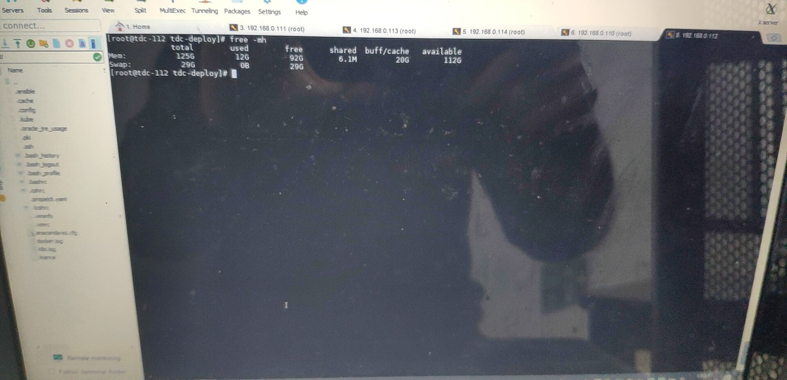
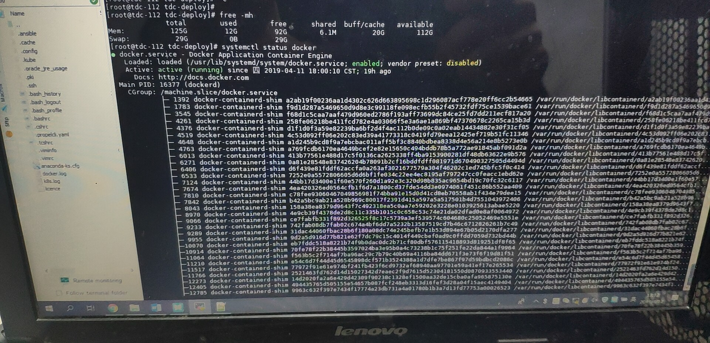

2019/04/12 13:08:48:**李健** : 
*******************************************************************************
2019/04/12 13:09:08:**太阳与冰** : 
*******************************************************************************
2019/04/12 13:09:15:**太阳与冰** : 
*******************************************************************************
2019/04/12 13:09:22:**太阳与冰** : 
*******************************************************************************
2019/04/12 13:09:29:**太阳与冰** : @Sean 
*************************************************************************************
2019/04/12 13:10:11:**Sean** : 嗯，现在这个租户一个多小时之后还是创建失败了。
*************************************************************************************
2019/04/12 13:11:09:**太阳与冰** : df -h  、 free -h 、systemctl status docker看一下
*************************************************************************************
2019/04/12 13:12:33:**Sean** : 
*******************************************************************************
2019/04/12 13:12:35:**Sean** : 
*******************************************************************************
2019/04/12 13:12:37:**Sean** : 
*******************************************************************************
2019/04/12 13:12:40:**Sean** : 
*******************************************************************************
2019/04/12 13:14:36:**Sean** : 
*******************************************************************************
2019/04/12 13:14:38:**Sean** : 
*******************************************************************************
2019/04/12 13:14:49:**Sean** : 现在新租户创建快一个小时了
*************************************************************************************
2019/04/12 13:15:57:**Sean** : 我上午最开始创建租户的时候，创建用户命名空间失败，然后参照wiki跑了下面是脚本
*************************************************************************************
2019/04/12 13:16:10:**Sean** : 
*******************************************************************************
2019/04/12 13:16:39:**Sean** : 可以创建命名空间，但是现在的情况是创建pod特别慢，不知道和这个有没有关系
*************************************************************************************
2019/04/12 13:29:22:**Anonymous** : 可以把邱维眀拉这里讨论
*************************************************************************************
2019/04/12 13:29:48:**Anonymous** : log看起来没有txsql
*************************************************************************************
2019/04/12 13:29:59:**Anonymous** : 也看看propeller日志
*************************************************************************************
2019/04/12 13:30:16:**Sean** : 对啊，用户空间里面这些pod都没有创建，所以都会有这种错误
*************************************************************************************
2019/04/12 13:31:10:**Anonymous** : txsql怎么只有一个pod
*************************************************************************************
2019/04/12 13:31:16:**Anonymous** : 进去看看能用吗？
*************************************************************************************
2019/04/12 13:32:07:**Sean** : 用户空间里面pod创建不了，很慢，现在里面没有txsql	,我这里说的慢不是pending这种状态，而是直接找不到
*************************************************************************************
2019/04/12 13:32:37:**Anonymous** : 最开始截图不是有吗
*************************************************************************************
2019/04/12 13:33:01:**Sean** : 
*******************************************************************************
2019/04/12 13:33:52:**Anonymous** : 重新创建一个看看吧
*************************************************************************************
2019/04/12 13:34:18:**Sean** : Txsql一个小时也没有出现，这些pod顺序也是乱的，多次创建租户都是一样的，这些pod不安顺序来
*************************************************************************************
2019/04/12 13:34:25:**Sean** : [捂脸]
*************************************************************************************
2019/04/12 13:34:37:**Anonymous** : pod没有顺序的吧
*************************************************************************************
2019/04/12 13:34:56:**Sean** : 对啊，但是一般情况下时间比较短看不出来
*************************************************************************************
2019/04/12 13:35:25:**Anonymous** : 重新创建
*************************************************************************************
2019/04/12 13:35:34:**Sean** : 欧克欧克
*************************************************************************************
2019/04/12 13:35:39:**Anonymous** : 然后把最新的propeller日志拿一下
*************************************************************************************
2019/04/12 13:36:52:**Anonymous** : 或者看下日志有啥错
*************************************************************************************
2019/04/12 13:37:05:**Sean** : 拉邱为民进来下，我没他好友
*************************************************************************************
2019/04/12 13:37:18:**张石胜** : "Anonymous"邀请"东风"加入了群聊
*************************************************************************************
2019/04/12 13:38:25:**Sean** : Propeller的日志在哪
*************************************************************************************
2019/04/12 13:38:46:**Sean** : <sysmsg type="revokemsg"><revokemsg><session>13369949065@chatroom</session><oldmsgid>1685955383</oldmsgid><msgid>2897945105166732783</msgid><replacemsg><![CDATA["Sean" 撤回了一条消息]]></replacemsg></revokemsg></sysmsg>
*************************************************************************************
2019/04/12 13:41:47:**Sean** : 不好意思，有点慢，我拍照片要出来一下，里面手机没信号
*************************************************************************************
2019/04/12 13:41:47:**Sean** : 
*******************************************************************************
2019/04/12 13:42:00:**Sean** : 
*******************************************************************************
2019/04/12 13:42:20:**Sean** : 
*******************************************************************************
2019/04/12 13:43:24:**Anonymous** : propeller的日志？
*************************************************************************************
2019/04/12 13:43:30:**Sean** : 嗯
*************************************************************************************
2019/04/12 13:43:51:**Anonymous** : 重启下？
*************************************************************************************
2019/04/12 13:43:56:**Sean** : kubectl logs看的 ，服务器吗
*************************************************************************************
2019/04/12 13:44:04:**Sean** : 服务器重启？
*************************************************************************************
2019/04/12 13:44:17:**Anonymous** : propeller
*************************************************************************************
