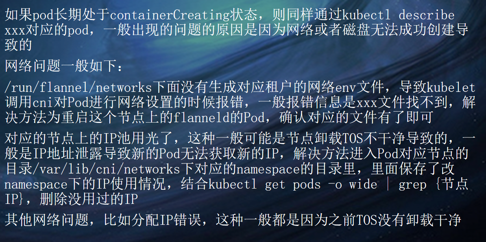
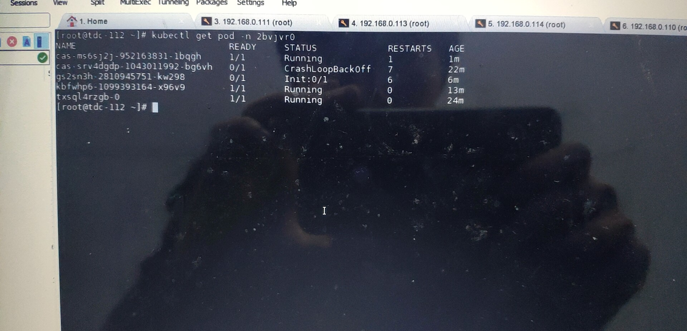
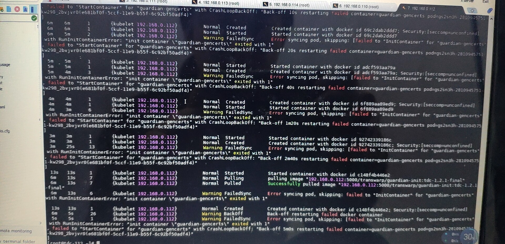
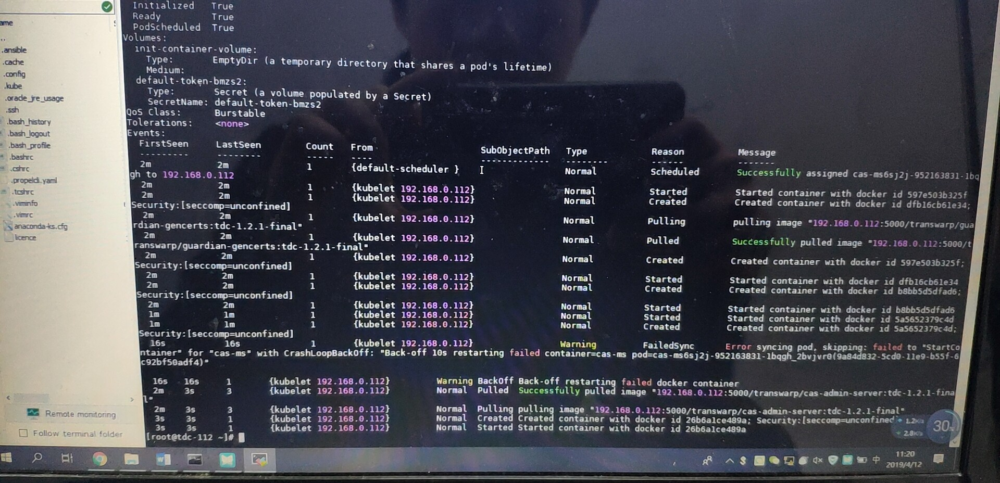
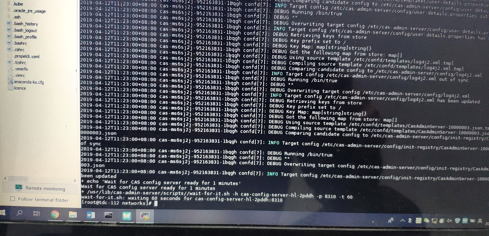
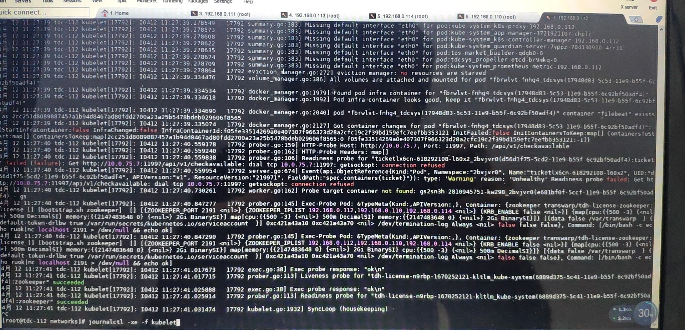
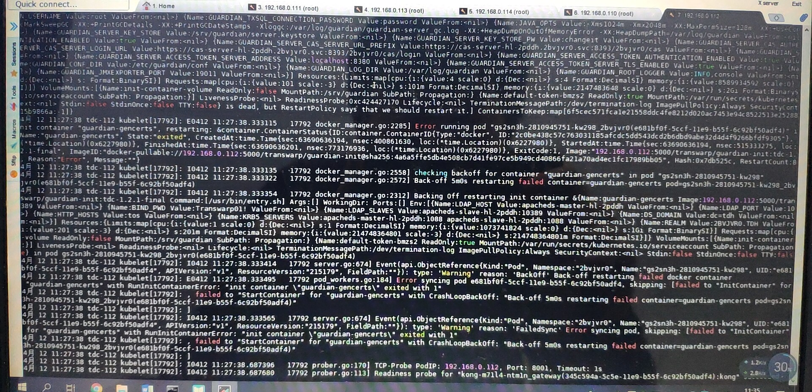

2019/04/12 11:15:15:**Sean** : 现在就是装tdc1.2.1，遇到了租户创建异常的现象
*************************************************************************************
2019/04/12 11:16:47:**Sean** : 现在是20分钟就用户空间创建了3个pod，不知道怎么解决，需要大佬们给点提示和建议
*************************************************************************************
2019/04/12 11:17:00:**太阳与冰** : 上面那个TDC起不来的问题，你们看看能不能出个简单的复盘文档~
*************************************************************************************
2019/04/12 11:17:18:**Sean** : 我把这个装上什么都好说
*************************************************************************************
2019/04/12 11:17:20:**Sean** : [捂脸]
*************************************************************************************
2019/04/12 11:17:36:**太阳与冰** : pod长时间创建不了的问题，你看看机器当前磁盘、cpu、内存是不是都正常？
*************************************************************************************
2019/04/12 11:18:26:**太阳与冰** : kubectl describe信息也发一下
*************************************************************************************
2019/04/12 11:18:30:**太阳与冰** : 
*******************************************************************************
2019/04/12 11:20:44:**Sean** : 
*******************************************************************************
2019/04/12 11:20:50:**Sean** : 
*******************************************************************************
2019/04/12 11:20:52:**Sean** : 
*******************************************************************************
2019/04/12 11:23:23:**Sean** : 检查过了，网络env文件是存在的，这个是新机器，IP用光的可能性不大
*************************************************************************************
2019/04/12 11:23:44:**太阳与冰** : docker和kubelet正常的么？
*************************************************************************************
2019/04/12 11:27:11:**Sean** : 检查过了，都是正常的
*************************************************************************************
2019/04/12 11:27:43:**Sean** : 有什么检查磁盘池是否正常挂载的命令吗
*************************************************************************************
2019/04/12 11:31:19:**Sean** : 没办法啊
*************************************************************************************
2019/04/12 11:31:19:**Sean** : 
*******************************************************************************
2019/04/12 11:31:28:**Sean** : <sysmsg type="revokemsg"><revokemsg><session>9623247053@chatroom</session><oldmsgid>1685954904</oldmsgid><msgid>5730057214992289602</msgid><replacemsg><![CDATA["Sean" 撤回了一条消息]]></replacemsg></revokemsg></sysmsg>
*************************************************************************************
2019/04/12 11:32:11:**太阳与冰** : 看一下kubelet的日志
*************************************************************************************
2019/04/12 11:36:14:**Sean** : 
*******************************************************************************
2019/04/12 11:36:41:**Sean** : 
*******************************************************************************
2019/04/12 11:36:45:**Sean** : 有报错的我发出来了
*************************************************************************************
2019/04/12 11:38:50:**狮锅艺** : 好像是容器的健康检查通不过啊 
*************************************************************************************
