2019/04/12 11:15:45:**三杯猪** : 你的length设置的多少？
*************************************************************************************
2019/04/12 11:17:30:**张亮亮** : 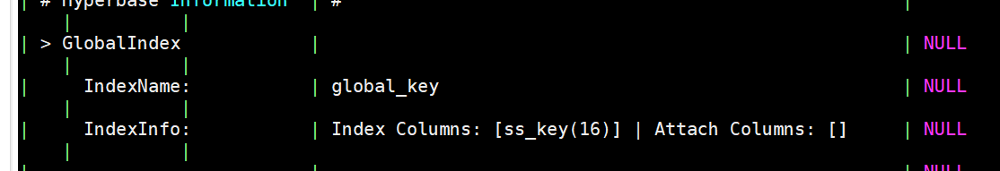
*******************************************************************************
2019/04/12 11:17:34:**张亮亮** : 16
*************************************************************************************
2019/04/12 11:17:58:**张亮亮** : 但是这个索引表的key 字段length是36
*************************************************************************************
2019/04/12 11:20:13:**三杯猪** : \x00这种有可能是对的，会放些占位符的。但是家里的机器坏了，我没有环境验证。

*************************************************************************************
2019/04/12 11:20:22:**三杯猪** : 你现在查询还是查不出来吗

*************************************************************************************
2019/04/12 11:25:15:**张亮亮** : 嗯嗯，查不出来，hive-serve的日志显示也是走索引了的；或者我可以采用命令的方式将二级索引走一次，看看是哪个环节的问题，我们的索引表的rowkey是（索引字段+源表rowkey）拼接的，二级索引查询的时候先去前缀匹配索引表的rowkey，然后怎么获取到源表的rowkey再回到源表检索数据了？这一块的逻辑是怎样的，对索引表rowkey进行切割么
*************************************************************************************
2019/04/12 11:25:48:**三杯猪** : 报错是啥
*************************************************************************************
2019/04/12 11:25:54:**三杯猪** : 还是超时吗
*************************************************************************************
2019/04/12 11:25:58:**张亮亮** : 超时
*************************************************************************************
2019/04/12 11:26:04:**三杯猪** : 超时10分钟？
*************************************************************************************
2019/04/12 11:26:19:**张亮亮** : local模式1分钟自动断掉
*************************************************************************************
2019/04/12 11:27:51:**三杯猪** : local mode这个超时能调大吗
*************************************************************************************
2019/04/12 11:28:03:**三杯猪** : 或者你用一个小表试一下
*************************************************************************************
2019/04/12 11:28:14:**三杯猪** : 只插一条数据
*************************************************************************************
2019/04/12 11:29:27:**张亮亮** : 昨晚小表试了，10条数据二级索引返回一条，2s，hive-server日志显示走索引表了，但是这个性能和不建索引的表的一样
*************************************************************************************
2019/04/12 11:29:34:**张亮亮** : <sysmsg type="revokemsg"><revokemsg><session>13980948538@chatroom</session><oldmsgid>1685954888</oldmsgid><msgid>6787059286600223217</msgid><replacemsg><![CDATA["星环 张亮亮" 撤回了一条消息]]></replacemsg></revokemsg></sysmsg>
*************************************************************************************
2019/04/12 11:29:37:**张亮亮** : 昨晚小表试了，10万条数据二级索引返回一条，2s，hive-server日志显示走索引表了，但是这个性能和不建索引的表的一样
*************************************************************************************
2019/04/12 11:29:54:**三杯猪** : 性能什么的另说
*************************************************************************************
2019/04/12 11:30:06:**三杯猪** : 先解决正确性

*************************************************************************************
2019/04/12 11:30:28:**三杯猪** : 那就是索引表没问题，但是数据量太大了
*************************************************************************************
2019/04/12 11:32:31:**张亮亮** : 我记得走二级索引这个数据量的性能没这么慢的[捂脸]，应该ms级别的
*************************************************************************************
2019/04/12 11:33:37:**三杯猪** : 不走索引日志里面是没有"hbase use index"。然后走索引日志里面有"hbase use index"，是吧

*************************************************************************************
2019/04/12 11:33:46:**三杯猪** : 最后确定一下

*************************************************************************************
2019/04/12 11:34:15:**三杯猪** : 我昨天把short circuit read关了，这个对性能是有影响的
*************************************************************************************
2019/04/12 11:34:22:**三杯猪** : 但是不应该慢这么多啊
*************************************************************************************
2019/04/12 11:36:29:**张亮亮** : 我重新跑一次并发日志出来
*************************************************************************************
2019/04/12 11:46:12:**三杯猪** : 对了，你索引表有多少个region？
*************************************************************************************
2019/04/12 11:50:47:**张亮亮** : 没索引的
*************************************************************************************
2019/04/12 11:50:48:**张亮亮** : 
走索引的

*************************************************************************************
2019/04/12 11:50:48:**张亮亮** : 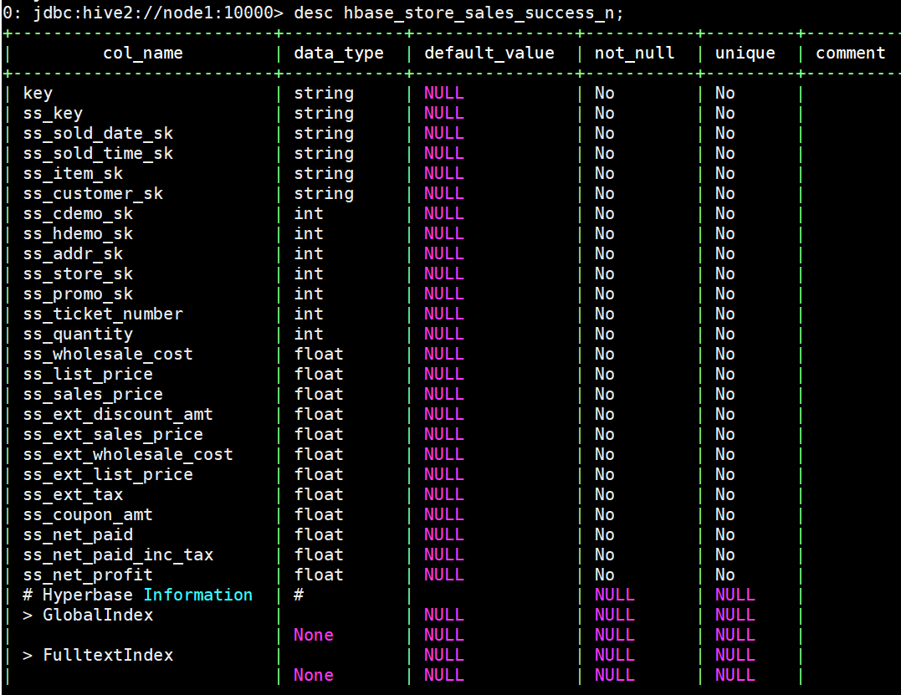
*******************************************************************************
2019/04/12 11:50:49:**张亮亮** : 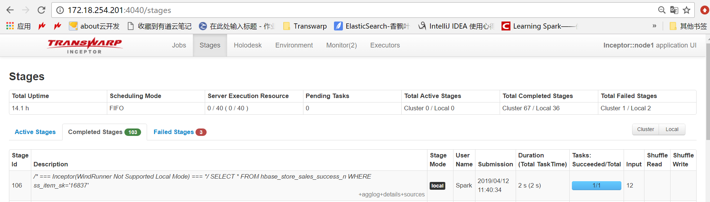
*******************************************************************************
2019/04/12 11:50:49:**张亮亮** : 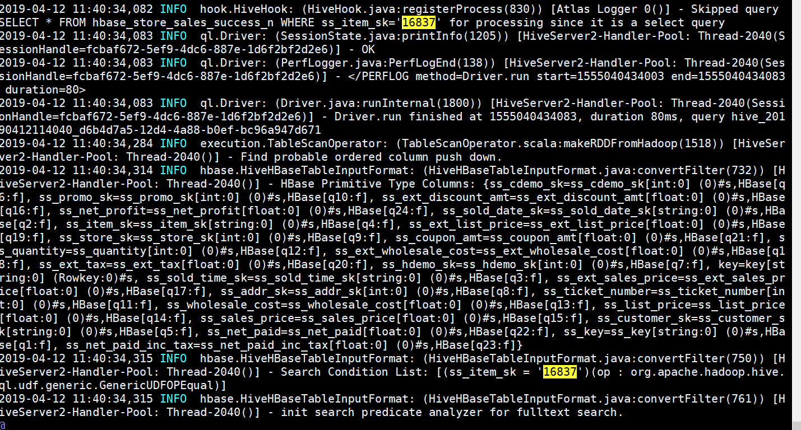
*******************************************************************************
2019/04/12 11:50:49:**张亮亮** : 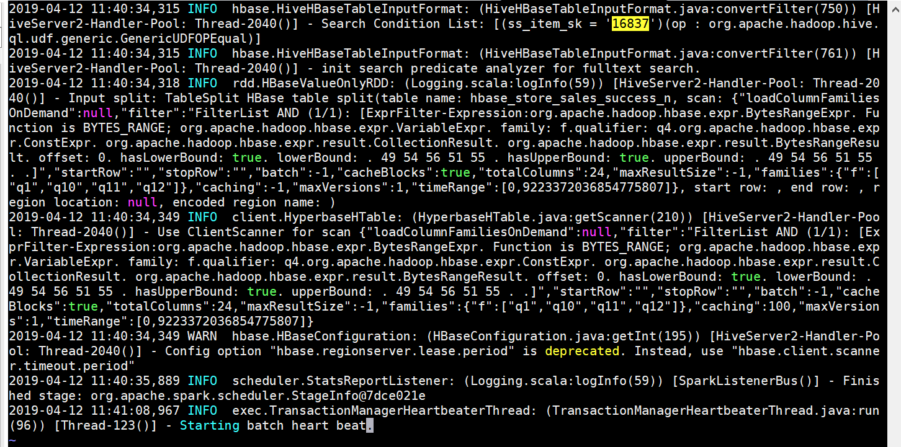
*******************************************************************************
2019/04/12 11:50:49:**张亮亮** : 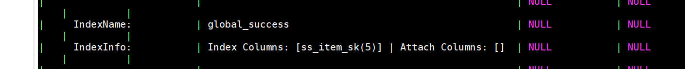
*******************************************************************************
2019/04/12 11:50:49:**张亮亮** : 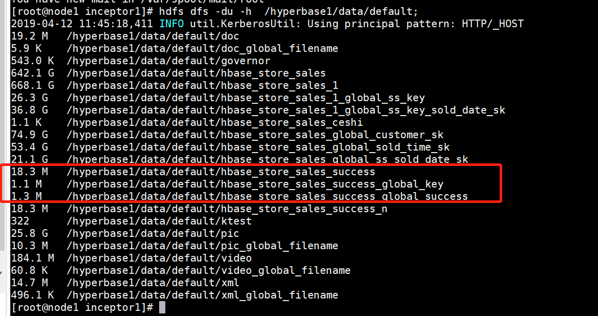
*******************************************************************************
2019/04/12 11:50:50:**张亮亮** : 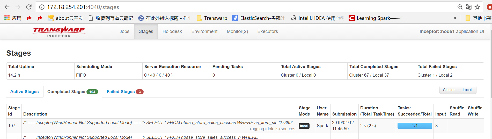
*******************************************************************************
2019/04/12 11:50:50:**张亮亮** : 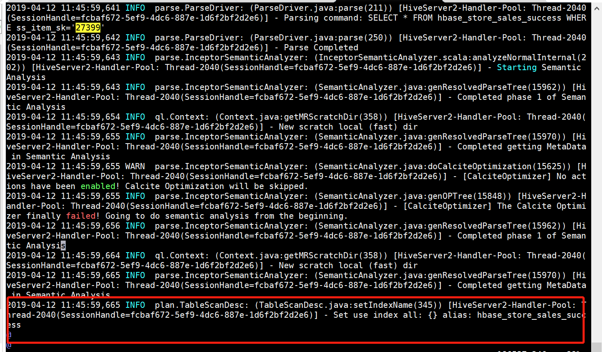
*******************************************************************************
2019/04/12 11:50:51:**张亮亮** : 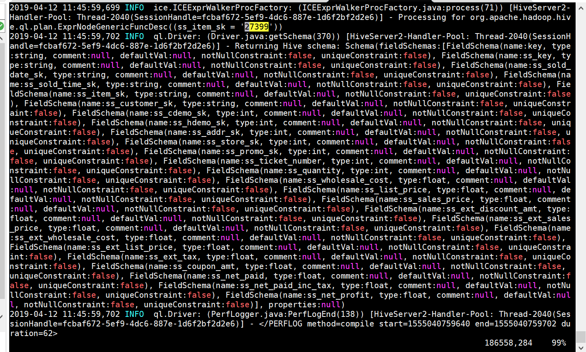
*******************************************************************************
2019/04/12 11:53:04:**张亮亮** : 43亿数据的表二级索引表的region有42个，10数据的二级索引表有1个region
*************************************************************************************
2019/04/12 11:59:26:**三杯猪** : 这两个的截图我这边是一起收到的。。。

*************************************************************************************
2019/04/12 12:00:16:**三杯猪** : 你搜"hbase use index"是只在走索引的那次的日志里才能搜到吧？

*************************************************************************************
2019/04/12 12:00:36:**张亮亮** : 感觉像是走索引了，但是这个性能有点不理想；43亿数据量的二级索引，返回结果一条，1分钟没跑出来自动断掉，已经有点慢了，这边都是要求秒级别的
*************************************************************************************
2019/04/12 12:01:22:**张亮亮** : 不是，不指定的话应该是 set use index all
*************************************************************************************
2019/04/12 12:01:23:**三杯猪** : 好，那就接着调性能，先用10万数据那个表
*************************************************************************************
2019/04/12 12:01:42:**三杯猪** : 哦，你是对的

*************************************************************************************
2019/04/12 12:02:25:**三杯猪** : 10万数据那个表split一下region你
*************************************************************************************
2019/04/12 12:02:32:**三杯猪** : 10万数据那个表split一下region呢
*************************************************************************************
2019/04/12 12:03:00:**三杯猪** : split region之后再查的话，走索引应该快了
*************************************************************************************
2019/04/12 12:16:58:**张亮亮** : split之后并没有变快
*************************************************************************************
2019/04/12 12:22:47:**张亮亮** : 不使用hint方式指定二级索引表查询，hive server日志中没有确切的调用那张索引表，只是直接访问了原来的表
*************************************************************************************
2019/04/12 12:22:47:**张亮亮** : 而hint的方式是有这个日志的
*************************************************************************************
2019/04/12 12:22:47:**张亮亮** : 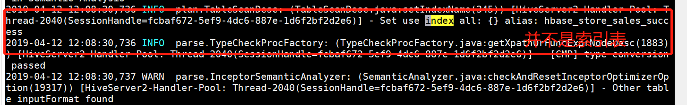
*******************************************************************************
2019/04/12 12:22:48:**张亮亮** : 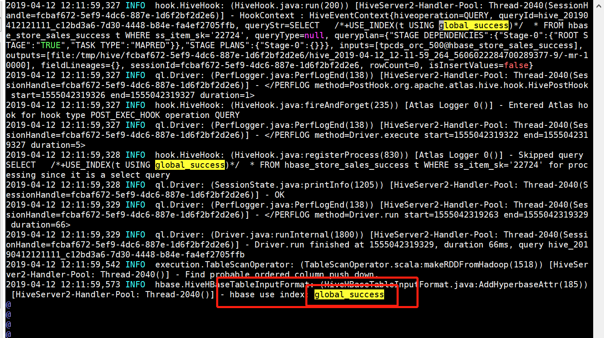
*******************************************************************************
2019/04/12 12:25:35:**三杯猪** : 好的，辛苦了
*************************************************************************************
2019/04/12 12:25:51:**三杯猪** : 我想想有啥办法可以加速
*************************************************************************************
2019/04/12 12:26:17:**三杯猪** : 现在应该确定索引表功能是可以用的了
*************************************************************************************
2019/04/12 14:03:37:**三杯猪** : 这个集群负载高吗
*************************************************************************************
2019/04/12 14:03:46:**张亮亮** : 不高
*************************************************************************************
2019/04/12 14:04:45:**三杯猪** : 如果直接hbase shell里面从索引表查询一条数据（prefix filter）要多久呢
*************************************************************************************
2019/04/12 14:06:32:**张亮亮** : 前缀匹配，查索引表还是查源表
*************************************************************************************
2019/04/12 14:06:43:**三杯猪** : 查索引表
*************************************************************************************
2019/04/12 14:06:53:**张亮亮** : 我查查
*************************************************************************************
2019/04/12 14:06:55:**三杯猪** : 做个测试，看看这一步要多久
*************************************************************************************
2019/04/12 14:10:02:**张亮亮** : 相当快
*************************************************************************************
2019/04/12 14:10:02:**张亮亮** : 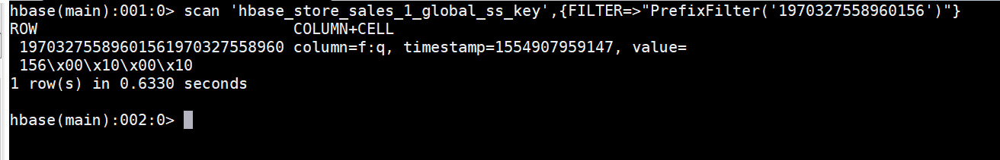
*******************************************************************************
2019/04/12 14:10:51:**三杯猪** : 这个是大表是吧？
*************************************************************************************
2019/04/12 14:10:55:**张亮亮** : 嗯嗯
*************************************************************************************
2019/04/12 14:14:21:**三杯猪** : dfs.client.read.shortcircuit
*************************************************************************************
2019/04/12 14:14:30:**三杯猪** : yarn的配置文件里面应该也有一个这个配置
*************************************************************************************
2019/04/12 14:14:38:**三杯猪** : 把这个也设置成false
*************************************************************************************
2019/04/12 14:14:49:**三杯猪** : 然后重启下，再试试呢
*************************************************************************************
2019/04/12 14:27:04:**张亮亮** : 没有效果，我找个家里的集群试着给你复现一下
*************************************************************************************
2019/04/12 14:32:44:**三杯猪** : 好的，辛苦了
*************************************************************************************
2019/04/12 14:47:00:**三杯猪** : 对了，你这个项目是POC阶段吗
*************************************************************************************
2019/04/12 14:48:44:**tlmdn** : 是
*************************************************************************************
