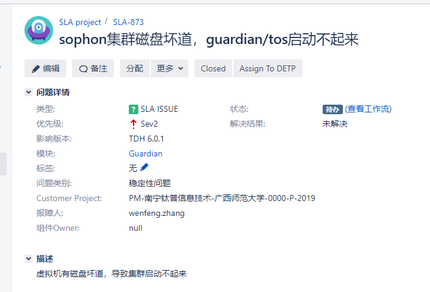
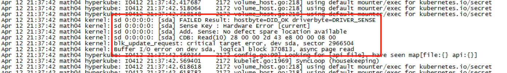

2019/04/12 13:04:48:**李健** : 
*******************************************************************************
2019/04/12 13:04:53:**太阳与冰** : @张文锋 
*************************************************************************************
2019/04/12 13:12:57:**张石胜** : "张文锋"邀请"熊～、cow、不搭"加入了群聊
*************************************************************************************
2019/04/12 13:13:16:**张文锋** : 
*******************************************************************************
2019/04/12 13:13:37:**张文锋** : @不搭 发一下项目的问题在群里
*************************************************************************************
2019/04/12 13:54:25:**不搭** : 
*******************************************************************************
2019/04/12 13:54:26:**不搭** : 
*******************************************************************************
2019/04/12 14:04:55:**不搭** : 
*******************************************************************************
2019/04/12 14:12:33:**太阳与冰** : 所以现在首先是tos起不来？
*************************************************************************************
2019/04/12 14:12:58:**太阳与冰** : df -h看一下
*************************************************************************************
2019/04/12 14:16:36:**不搭** : 
*******************************************************************************
2019/04/12 14:16:47:**不搭** : guardian也起不来
*************************************************************************************
2019/04/12 14:23:09:**太阳与冰** : sda盘是坏的对吧
*************************************************************************************
2019/04/12 14:23:43:**太阳与冰** : 根目录挂载在哪个盘下面啊？
*************************************************************************************
2019/04/12 14:23:44:**张石胜** : "王永成"邀请"SLA-007"加入了群聊
*************************************************************************************
2019/04/12 14:24:48:**不搭** : sda
*************************************************************************************
2019/04/12 14:24:49:**不搭** : 
*******************************************************************************
2019/04/12 14:26:03:**太阳与冰** : 所以现在根目录所在的磁盘坏了对吧？如果根目录磁盘满了或者有问题的话，tos是会起不来的~
*************************************************************************************
2019/04/12 14:28:37:**不搭** : 这个有什么办法吗？
*************************************************************************************
2019/04/12 14:32:40:**张石胜** : "李健"邀请"bianyu"加入了群聊
*************************************************************************************
2019/04/12 14:33:12:**太阳与冰** : 
*******************************************************************************
2019/04/12 14:33:58:**太阳与冰** : @bianyu [呲牙]雨神，确认一个事，根目录挂载的磁盘坏道了，这个时候tos是起不来的吧？
*************************************************************************************
2019/04/12 14:34:09:**太阳与冰** : @不搭 linux系统现在是好的麽？
*************************************************************************************
2019/04/12 14:35:42:**不搭** : 嗯嗯正常，但是后台会一直显示
*************************************************************************************
2019/04/12 14:35:47:**不搭** : 
*******************************************************************************
2019/04/12 14:35:57:**太阳与冰** : 讲道理根目录有问题了，linux系统可能也会有安全风险
*************************************************************************************
2019/04/12 14:36:28:**太阳与冰** : 类似rm -rf /*删库跑路这种[捂脸]
*************************************************************************************
2019/04/12 14:42:05:**不搭** : 别的服务正常
*************************************************************************************
2019/04/12 14:42:06:**不搭** : 
*******************************************************************************
2019/04/12 14:46:07:**bianyu** : 其实具体分析了. 如果是TOS用到的文件坏了这个也是正常现象.
*************************************************************************************
2019/04/12 14:47:36:**不搭** : 这边可以远程，方便远程看一下吗？
*************************************************************************************
2019/04/12 14:50:57:**bianyu** : 不看了, 感觉没什么意义. 先换磁盘吧.
*************************************************************************************
