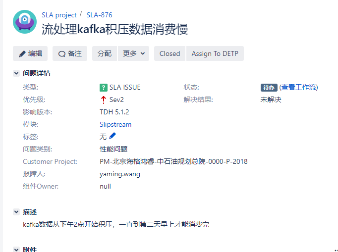
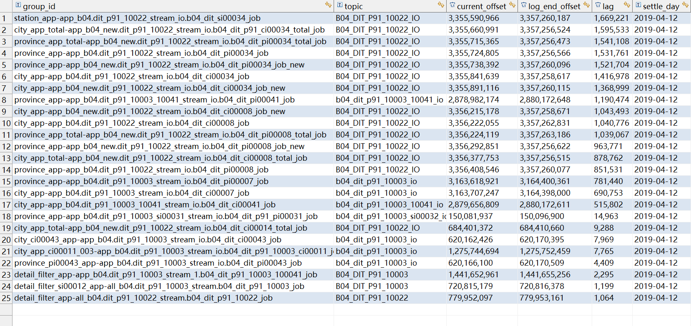
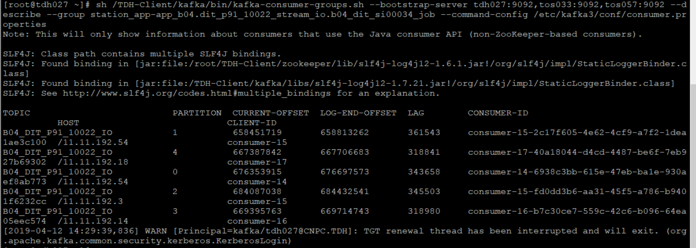
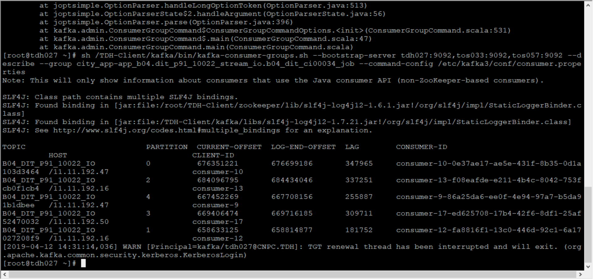
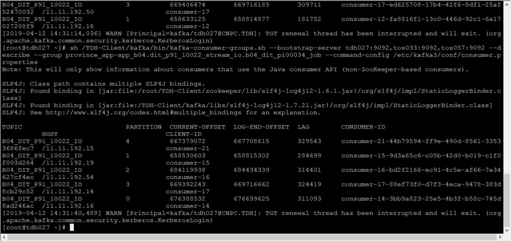

2019/04/12 14:16:59:**李健** : 
*******************************************************************************
2019/04/12 14:17:11:**太阳与冰** : @正能量光环 
*************************************************************************************
2019/04/12 14:17:14:**太阳与冰** : @旮旯 @郑圣瑜 
*************************************************************************************
2019/04/12 14:19:04:**张石胜** : "星环王亚茗"邀请"Joiln"加入了群聊
*************************************************************************************
2019/04/12 14:19:13:**张石胜** : "星环王亚茗"邀请"赵志伟"加入了群聊
*************************************************************************************
2019/04/12 14:19:30:**张石胜** : "星环王亚茗"邀请"@@@"加入了群聊
*************************************************************************************
2019/04/12 14:20:35:**张石胜** : "赵志伟"邀请"BMEIO"加入了群聊
*************************************************************************************
2019/04/12 14:21:53:**赵志伟** : 佳佳，看一下kafka生产的topic是不是积压，截个图
*************************************************************************************
2019/04/12 14:22:20:**张石胜** : "星环王亚茗"邀请"Hiker"加入了群聊
*************************************************************************************
2019/04/12 14:24:49:**BMEIO** : 好的
*************************************************************************************
2019/04/12 14:26:15:**BMEIO** : 
*******************************************************************************
2019/04/12 14:27:08:**赵志伟** : 截kafka的图
*************************************************************************************
2019/04/12 14:27:20:**BMEIO** : 好的
*************************************************************************************
2019/04/12 14:28:16:**赵志伟** : @太阳与冰 估计要拉季钱飞进来，昨天和季老师沟通，是他要求提交SLA的
*************************************************************************************
2019/04/12 14:31:26:**BMEIO** : 
*******************************************************************************
2019/04/12 14:32:38:**BMEIO** : 
*******************************************************************************
2019/04/12 14:33:05:**BMEIO** : 
*******************************************************************************
2019/04/12 15:02:21:**赵志伟** : 各位老师，这个问题是被分省公司投诉到中石油规划总院的问题，之所以没提升到SLA1，因为这是个长期存在的问题，所以客户给咱们解决的时间多一些，请各位老师帮忙检查一下吧
*************************************************************************************
2019/04/12 15:07:28:**张石胜** : "吴家宝"邀请"王成、季钱飞"加入了群聊
*************************************************************************************
2019/04/12 15:08:07:**赵志伟** : 该类型暂不支持，请在手机上查看
*************************************************************************************
2019/04/12 15:08:32:**赵志伟** : 每天中午开始kafka的积压就很大
*************************************************************************************
2019/04/12 15:10:29:**旮旯** : 稳定的积压，而且会在第二天被消费完
*************************************************************************************
2019/04/12 15:10:36:**赵志伟** : 嗯
*************************************************************************************
2019/04/12 15:11:17:**赵志伟** : 第二天早上9点前再监控，积压就很少了10万以内的topic都很少
*************************************************************************************
2019/04/12 15:11:32:**旮旯** : 现在这个集群的计算规模多大啊，kafka那边的数据量呢
*************************************************************************************
2019/04/12 15:15:19:**赵志伟** : kafka和slipstream都是10个节点
*************************************************************************************
2019/04/12 15:15:49:**赵志伟** : 且两个组件都安装在了这10个节点上
*************************************************************************************
2019/04/12 15:17:45:**赵志伟** : 嘉佳、玉建，你俩分别查一下每天落地到明细表的数据量
*************************************************************************************
2019/04/12 15:17:56:**赵志伟** : @BMEIO @@@@ 
*************************************************************************************
2019/04/12 15:18:24:**BMEIO** : 好
*************************************************************************************
2019/04/12 15:34:21:**旮旯** : 目前的情况是每天这个流的executor都会稳定的发生大量fgc的情况？@赵志伟 
*************************************************************************************
2019/04/12 16:52:21:**BMEIO** : [点我进附件](https://github.com/CorkiZhang/itchat-message/tree/master/sla2-876中石油流kafka积压数据/ATTACHMENT/4月11日明细表数据统计.xls)
*******************************************************************************
2019/04/12 16:52:26:**BMEIO** : @季钱飞 
*************************************************************************************
2019/04/12 16:55:40:**季钱飞** : 昨天我跟志伟说过了，积压的时候看看jstack吧，到底是卡在哪儿
*************************************************************************************
2019/04/12 16:56:14:**Joiln** : 季神，那今天晚上6点多就应该有了
*************************************************************************************
2019/04/12 16:56:35:**季钱飞** : 先找到原因吧
*************************************************************************************
2019/04/12 16:58:31:**季钱飞** : 先确定是否是数据量太大，还是说hbase lookup慢 还是其他什么原因导致的
*************************************************************************************
2019/04/12 17:08:37:**季钱飞** : 
*******************************************************************************
2019/04/12 17:08:50:**季钱飞** : 现在glkjoin要1w条/s？
*************************************************************************************
2019/04/12 17:09:54:**赵志伟** : 现实没有那么大，只是张鹏飞说产品没有那么大的吞吐量
*************************************************************************************
2019/04/12 17:10:11:**季钱飞** : 现在是多大的吞吐呢
*************************************************************************************
2019/04/12 17:10:52:**赵志伟** : 平均2-3千/秒，这是之前兆东测的结果
*************************************************************************************
2019/04/12 17:10:53:**季钱飞** : 那边1条lookup1次，之前测下来一个partition不超过300/s吧
*************************************************************************************
2019/04/12 17:11:21:**季钱飞** : 所以出现积压是因为数据量增大了吗
*************************************************************************************
2019/04/12 17:13:21:**季钱飞** : 如果是， 那就增加partition数量吧
*************************************************************************************
2019/04/12 17:17:20:**@@@** : 
*******************************************************************************
2019/04/12 17:17:39:**@@@** : 积压较大的topic分区是五
*************************************************************************************
2019/04/12 17:20:58:**季钱飞** : @旮旯 你先帮忙看看吧
*************************************************************************************
2019/04/12 17:22:39:**吴家宝** : 嗯
*************************************************************************************
2019/04/12 17:23:32:**季钱飞** : 你要有空上来我跟你讲讲
*************************************************************************************
2019/04/12 17:23:41:**季钱飞** : 
*******************************************************************************
2019/04/12 17:23:48:**@@@** : 
*******************************************************************************
2019/04/12 17:24:56:**@@@** : 
*******************************************************************************
2019/04/12 17:27:53:**季钱飞** : 这两次之间间隔多久跑的
*************************************************************************************
2019/04/12 17:28:21:**吴家宝** : 我开完会上去
*************************************************************************************
2019/04/12 17:28:54:**@@@** : 这是两个job的积压情况
*************************************************************************************
2019/04/12 17:29:40:**季钱飞** : 额
*************************************************************************************
