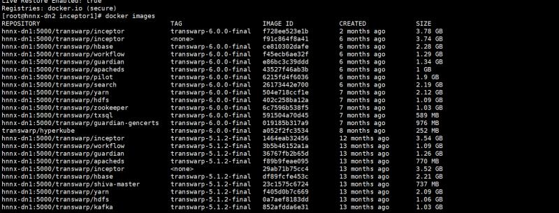
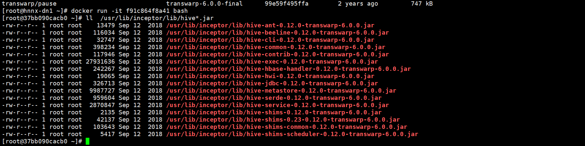
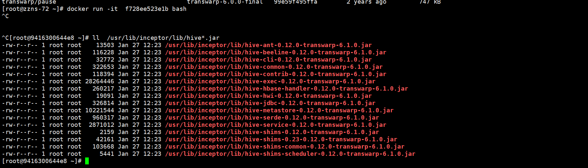

2019/04/12 11:20:08:**苦行僧** : 两个都有用
*************************************************************************************
2019/04/12 11:22:37:**苦行僧** : 第一链接是下载manager的安装包，第二个链接下载Registry和Machine-Learning相关的软件包
*************************************************************************************
2019/04/12 11:23:26:**苦行僧** : 去年九月份的时候下载的
*************************************************************************************
2019/04/12 11:27:31:**江南晚来客** : 对，我好奇的是你们用的百度网盘还是ownCloud
*************************************************************************************
2019/04/12 11:27:46:**江南晚来客** : 然后，可是你们集群上docker image，看到的最新的inceptor image tag 是今年打的
*************************************************************************************
2019/04/12 11:27:51:**苦行僧** : 用的百度网盘
*************************************************************************************
2019/04/12 11:27:52:**江南晚来客** : 是因为workflow 换包么
*************************************************************************************
2019/04/12 11:27:53:**江南晚来客** : 好的
*************************************************************************************
2019/04/12 11:34:04:**苦行僧** : 和同事确认了，没有换过workflow的包
*************************************************************************************
2019/04/12 11:34:50:**江南晚来客** : 
*******************************************************************************
2019/04/12 11:35:09:**江南晚来客** : 但是inceptor image 2月前改过……
*************************************************************************************
2019/04/12 11:35:57:**江南晚来客** : 你现在在现场么
*************************************************************************************
2019/04/12 11:36:25:**江南晚来客** : 在的话可以docker run f91c那个 image 
*************************************************************************************
2019/04/12 11:36:31:**苦行僧** : 在的
*************************************************************************************
2019/04/12 11:36:33:**江南晚来客** : 就是inceptor 6.0.0-final 的第二个image
*************************************************************************************
2019/04/12 11:36:41:**江南晚来客** : 然后进去看看 /usr/lib/inceptor/lib/hive*.jar
*************************************************************************************
2019/04/12 11:36:43:**苦行僧** : 好
*************************************************************************************
2019/04/12 11:37:51:**苦行僧** : 
*******************************************************************************
2019/04/12 11:38:03:**苦行僧** : 这个时6.0.0的jar包
*************************************************************************************
2019/04/12 11:38:33:**江南晚来客** : 好的，稳
*************************************************************************************
2019/04/12 11:44:14:**江南晚来客** : 然后你确定是河南农信
*************************************************************************************
2019/04/12 11:44:18:**江南晚来客** : 不是郑商所？
*************************************************************************************
2019/04/12 11:44:48:**苦行僧** : 是河南农信
*************************************************************************************
2019/04/12 11:45:08:**苦行僧** : 我现在就在现场
*************************************************************************************
2019/04/12 11:46:11:**江南晚来客** : 好的
*************************************************************************************
2019/04/12 11:49:56:**苦行僧** : @江南晚来客  我们这边另一个开发集群也有这种情况
*************************************************************************************
2019/04/12 11:49:58:**苦行僧** : 
*******************************************************************************
2019/04/12 11:50:49:**江南晚来客** : 你们是不是参考TDT 群里的升级教程了
*************************************************************************************
2019/04/12 11:50:52:**江南晚来客** : 升级了TDT
*************************************************************************************
2019/04/12 11:51:33:**苦行僧** : 测试集群升级过的，这个开发集群是直接安装的
*************************************************************************************
2019/04/12 11:52:13:**江南晚来客** : 我能看下升级教程么
*************************************************************************************
2019/04/12 11:53:11:**苦行僧** : 是升级TDH吗
*************************************************************************************
2019/04/12 11:54:43:**江南晚来客** : 你们测试集群，是升级了TDH 还是升级了TDT？
*************************************************************************************
2019/04/12 11:56:13:**江南晚来客** : 之前应该说的没升级TDH，只升级了TDT吧
*************************************************************************************
2019/04/12 11:56:41:**苦行僧** : 升级了TDH
*************************************************************************************
2019/04/12 11:56:47:**江南晚来客** : ！
*************************************************************************************
2019/04/12 11:56:54:**苦行僧** : 之前是5.1.2-final版本的
*************************************************************************************
2019/04/12 11:56:58:**江南晚来客** : 6.0.0 升级到6.1？
*************************************************************************************
2019/04/12 11:57:00:**江南晚来客** : 噢
*************************************************************************************
2019/04/12 11:57:35:**江南晚来客** : 他换的好像是与workflow和transport 的包
*************************************************************************************
2019/04/12 11:57:50:**江南晚来客** : 那你之前说的这个，能确定嘛
*************************************************************************************
