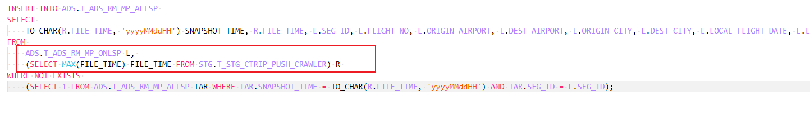
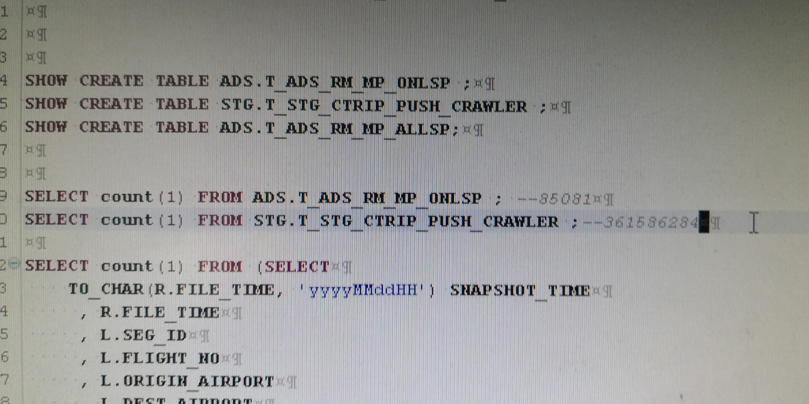

2019/04/12 12:04:03:**吴家宝** : @ΔS 
*************************************************************************************
2019/04/12 12:04:05:**吴家宝** : 
*******************************************************************************
2019/04/12 12:04:17:**吴家宝** : 你看下这两个的数据量分别有多少
*************************************************************************************
2019/04/12 12:05:16:**ΔS** : 之前看了一个32m 一个10g
*************************************************************************************
2019/04/12 12:05:48:**吴家宝** : 不是，我是说你select一下，看看有多少条数据
*************************************************************************************
2019/04/12 12:13:56:**ΔS** : 
*******************************************************************************
2019/04/12 13:33:44:**吴家宝** : 你可以放弃了
*************************************************************************************
2019/04/12 13:34:08:**吴家宝** : 这个笛卡儿积肯定是算不出来的
*************************************************************************************
