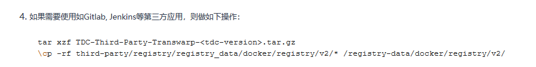
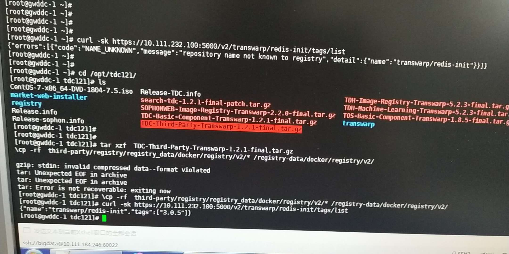

2019/04/12 11:26:38:**喵** : 该类型暂不支持，请在手机上查看
*************************************************************************************
2019/04/12 11:26:56:**喵** : @陈夏明 夏明，这样是没有镜像在registry里吗?
*************************************************************************************
2019/04/12 11:32:10:**陈夏明** : 能够tv吗
*************************************************************************************
2019/04/12 13:44:55:**张石胜** : "陈夏明"邀请"Maxwell"加入了群聊
*************************************************************************************
2019/04/12 13:45:15:**张石胜** : "陈夏明"邀请"Anonymous"加入了群聊
*************************************************************************************
2019/04/12 13:45:26:**陈夏明** : 在这里讨论吧，围观下
*************************************************************************************
2019/04/12 14:14:26:**张石胜** : "Maxwell"邀请"Z"加入了群聊
*************************************************************************************
2019/04/12 14:14:55:**Maxwell** : 查了一下，没有Redis init这个image
*************************************************************************************
2019/04/12 14:16:14:**Z** : 这个可以怎么处理下嘛？
*************************************************************************************
2019/04/12 14:21:13:**Anonymous** : 找ai要image😳，或者pull一下试试😂
*************************************************************************************
2019/04/12 14:22:24:**喵** : 去年八月份韩冰修改的jsonnet，增加了init container。对应的image也是他提供的，所以我们一直没管redis init container image.
*************************************************************************************
2019/04/12 14:22:51:**Z** : 这个可以从哪个地方找到嘛？？
*************************************************************************************
2019/04/12 14:24:32:**喵** : @陈夏明 夏明，关于redis init image，这个是应该打包在哪里呢?
*************************************************************************************
2019/04/12 14:25:45:**Maxwell** : 你有tdc-third-party这个包吗？
*************************************************************************************
2019/04/12 14:26:04:**Z** : 有的，但是我没有使用这个。。
*************************************************************************************
2019/04/12 14:27:09:**Maxwell** : 你加载这个包试试
*************************************************************************************
2019/04/12 14:27:27:**Z** : 
*******************************************************************************
2019/04/12 14:27:32:**Z** : 这样？？
*************************************************************************************
2019/04/12 14:27:47:**Maxwell** : 嗯
*************************************************************************************
2019/04/12 14:31:40:**Z** : 
*******************************************************************************
2019/04/12 14:31:43:**Z** : 有了
*************************************************************************************
2019/04/12 14:32:15:**Maxwell** : 你重启一下propeller再试试
*************************************************************************************
2019/04/12 14:32:24:**Z** : 已经在弄了
*************************************************************************************
2019/04/12 14:35:42:**Z** : ok，已经在开始部署了。
*************************************************************************************
2019/04/12 14:39:29:**Z** : @喵 nfs-pvc还是需要手动创建是嘛？
*************************************************************************************
2019/04/12 14:40:12:**喵** : 是的
*************************************************************************************
