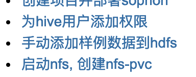
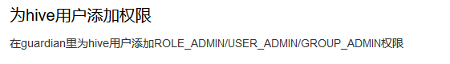
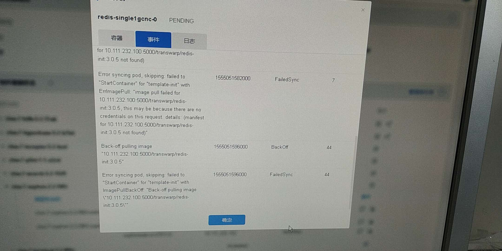
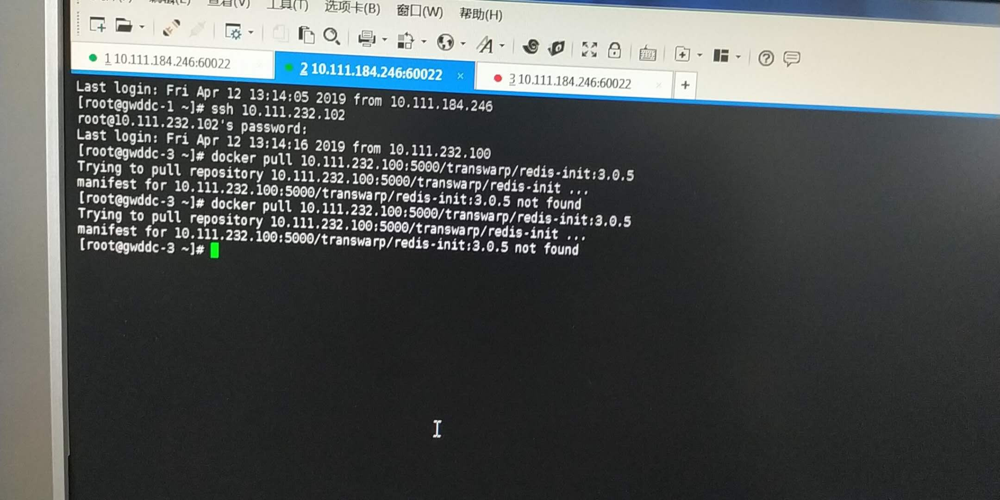

2019/04/12 11:26:38:**喵** : 该类型暂不支持，请在手机上查看
*************************************************************************************
2019/04/12 11:26:56:**喵** : @陈夏明 夏明，这样是没有镜像在registry里吗?
*************************************************************************************
2019/04/12 11:32:10:**陈夏明** : 能够tv吗
*************************************************************************************
2019/04/12 13:44:55:**张石胜** : "陈夏明"邀请"Maxwell"加入了群聊
*************************************************************************************
2019/04/12 13:45:15:**张石胜** : "陈夏明"邀请"Anonymous"加入了群聊
*************************************************************************************
2019/04/12 13:45:26:**陈夏明** : 在这里讨论吧，围观下
*************************************************************************************
2019/04/12 14:14:26:**张石胜** : "Maxwell"邀请"Z"加入了群聊
*************************************************************************************
2019/04/12 14:14:55:**Maxwell** : 查了一下，没有Redis init这个image
*************************************************************************************
2019/04/12 14:16:14:**Z** : 这个可以怎么处理下嘛？
*************************************************************************************
2019/04/12 14:21:13:**Anonymous** : 找ai要image😳，或者pull一下试试😂
*************************************************************************************
2019/04/12 14:22:24:**喵** : 去年八月份韩冰修改的jsonnet，增加了init container。对应的image也是他提供的，所以我们一直没管redis init container image.
*************************************************************************************
2019/04/12 14:22:51:**Z** : 这个可以从哪个地方找到嘛？？
*************************************************************************************
2019/04/12 14:24:32:**喵** : @陈夏明 夏明，关于redis init image，这个是应该打包在哪里呢?
*************************************************************************************
2019/04/12 14:25:45:**Maxwell** : 你有tdc-third-party这个包吗？
*************************************************************************************
2019/04/12 14:26:04:**Z** : 有的，但是我没有使用这个。。
*************************************************************************************
2019/04/12 14:27:09:**Maxwell** : 你加载这个包试试
*************************************************************************************
2019/04/12 14:27:27:**Z** : 
*******************************************************************************
2019/04/12 14:27:32:**Z** : 这样？？
*************************************************************************************
2019/04/12 14:27:47:**Maxwell** : 嗯
*************************************************************************************
2019/04/12 14:31:40:**Z** : 
*******************************************************************************
2019/04/12 14:31:43:**Z** : 有了
*************************************************************************************
2019/04/12 14:32:15:**Maxwell** : 你重启一下propeller再试试
*************************************************************************************
2019/04/12 14:32:24:**Z** : 已经在弄了
*************************************************************************************
2019/04/12 14:35:42:**Z** : ok，已经在开始部署了。
*************************************************************************************
2019/04/12 14:39:29:**Z** : @喵 nfs-pvc还是需要手动创建是嘛？
*************************************************************************************
2019/04/12 14:40:12:**喵** : 是的
*************************************************************************************
2019/04/12 14:40:35:**Z** : 和tdh创建有什么不同嘛？？
*************************************************************************************
2019/04/12 14:40:53:**喵** : 一致
*************************************************************************************
2019/04/12 14:42:15:**喵** : http://172.16.1.168:8090/pages/viewpage.action?pageId=18681256 有个wiki, 可以参考一下
*************************************************************************************
2019/04/12 14:42:41:**喵** : 这3点比较重要
*************************************************************************************
2019/04/12 14:42:41:**喵** : 
*******************************************************************************
2019/04/12 14:42:53:**Z** : 好的，谢谢了
*************************************************************************************
2019/04/12 14:43:47:**Z** : 这个guardian是指租户的guardian嘛？
*************************************************************************************
2019/04/12 14:43:56:**Z** : 
*******************************************************************************
2019/04/12 14:44:35:**喵** : 是的，人工智能产品下的guardian
*************************************************************************************
2019/04/12 14:46:50:**Z** : 
*******************************************************************************
2019/04/12 14:47:15:**Z** : 这个pod还是有redis-init的问题
*************************************************************************************
2019/04/12 14:50:15:**陈夏明** : 是的在第三方包里
*************************************************************************************
2019/04/12 14:52:13:**Maxwell** : 你到 redis-single那个pod的节点上docker pull xxx那个image
*************************************************************************************
2019/04/12 14:52:37:**Maxwell** : 看能不能pull下来
*************************************************************************************
2019/04/12 14:54:39:**Z** : 
*******************************************************************************
2019/04/12 16:50:00:**Z** : 度不行。。。
*************************************************************************************
2019/04/12 16:51:25:**喵** : 现在redis启动ok了吗?
*************************************************************************************
2019/04/12 16:51:48:**Z** : 没有，还没有redis-init这个image
*************************************************************************************
2019/04/12 16:52:20:**喵** : ok, sophon依赖redis,所以没有redis的情况下sophon启动失败是正常的
*************************************************************************************
2019/04/12 16:55:48:**Z** : 家里环境能找到这个image嘛？？
*************************************************************************************
2019/04/12 16:58:32:**Maxwell** : @陈夏明
*************************************************************************************
2019/04/12 17:05:52:**陈夏明** : 第三方包里有的
*************************************************************************************
2019/04/12 17:06:02:**陈夏明** : 看下报的Release.info
*************************************************************************************
2019/04/12 17:06:08:**陈夏明** : 172.16.1.99/transwarp/redis:3.0.5 =>[ 547ff219e796 ] at [ 2019-03-05 16:32:18 ]
172.16.1.99/transwarp/redis-init:3.0.5 =>[ 2cafb8141f52 ] at [ 2019-03-05 16:32:45 ]
*************************************************************************************
2019/04/12 17:06:23:**Z** : 怎么把这个image加上去呢？？
*************************************************************************************
2019/04/12 17:06:59:**陈夏明** : 和导入sophon镜像一样的
*************************************************************************************
2019/04/12 17:07:08:**陈夏明** : 参考官网部署文档
*************************************************************************************
2019/04/12 17:07:40:**Z** : 第三方包已经加进来了
*************************************************************************************
2019/04/12 17:07:54:**Z** : 
*******************************************************************************
2019/04/12 17:07:57:**Z** : 这个已经执行了。
*************************************************************************************
2019/04/12 17:08:22:**陈夏明** : 咱又绕回来了
*************************************************************************************
2019/04/12 17:08:39:**Z** : 
*******************************************************************************
2019/04/12 17:08:42:**陈夏明** : 
*******************************************************************************
2019/04/12 17:08:55:**Z** : 重启那个propeller-etcd??
*************************************************************************************
2019/04/12 17:09:14:**Z** : 😂难受了
*************************************************************************************
2019/04/12 17:09:17:**陈夏明** : 看_manifest/tags
*************************************************************************************
2019/04/12 17:09:32:**陈夏明** : 下面有没有版本号，有说明更新成功了
*************************************************************************************
2019/04/12 17:09:44:**Z** : 
*******************************************************************************
2019/04/12 17:09:47:**陈夏明** : 然后刷新propeller缓存数据就ok
*************************************************************************************
2019/04/12 17:09:47:**Z** : 有的
*************************************************************************************
