2019/04/12 16:15:12:**何所思** : yum install --nogpgcheck
*************************************************************************************
2019/04/12 16:15:14:**何所思** : 试试？
*************************************************************************************
2019/04/12 16:18:25:**吴涛** : ./install的时候应该用不了yum命令吧
*************************************************************************************
2019/04/12 16:18:37:**吴涛** : 毕竟还没有配置yum源
*************************************************************************************
2019/04/12 16:18:40:**吴涛** : 正常来说
*************************************************************************************
2019/04/12 16:21:42:**吴涛** : 我用rpm直接安装试试[捂脸]
*************************************************************************************
2019/04/12 16:23:41:**吴涛** : 直接使用rpm能安装java
*************************************************************************************
2019/04/12 16:24:06:**吴涛** : 然后就能进入网页版安装了。。。
*************************************************************************************
2019/04/12 16:24:34:**何所思** : [强][强][强]
*************************************************************************************
2019/04/12 16:25:00:**吴涛** : 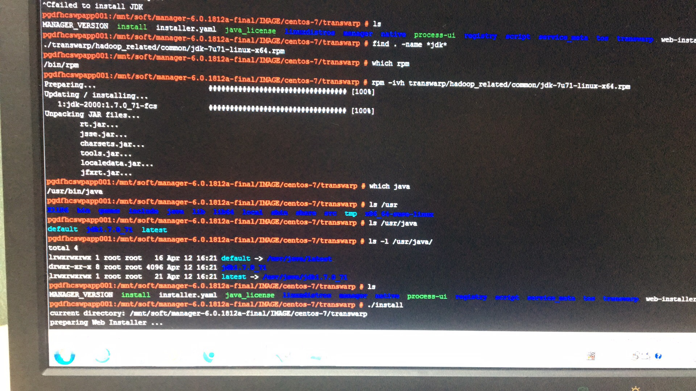
*******************************************************************************
2019/04/12 16:25:11:**吴涛** : 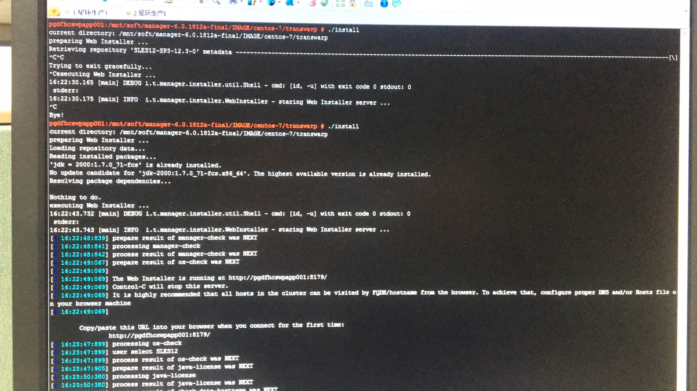
*******************************************************************************
2019/04/12 16:25:54:**吴涛** : 第一次安装，心惊胆跳地。。。。
*************************************************************************************
2019/04/12 16:30:43:**吴涛** : 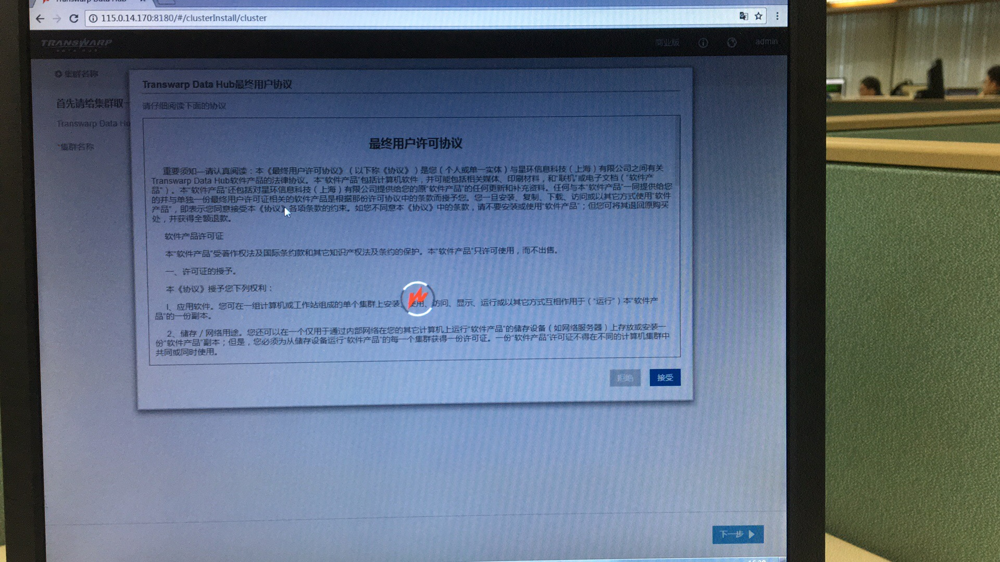
*******************************************************************************
2019/04/12 16:30:49:**吴涛** : 这问题有人反馈过吗？
*************************************************************************************
2019/04/12 16:30:53:**吴涛** : @何所思 
*************************************************************************************
2019/04/12 16:31:14:**吴涛** : 就是安装的时候，第一次用admin登录，会卡死在这里，需要刷新一次才能继续
*************************************************************************************
2019/04/12 16:33:31:**何所思** : 有
*************************************************************************************
2019/04/12 16:40:58:**吴涛** : 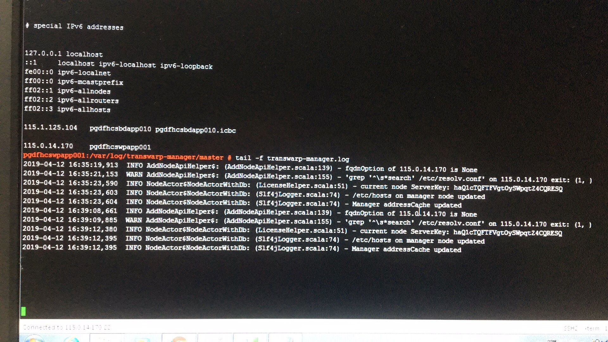
*******************************************************************************
2019/04/12 16:41:02:**吴涛** : 添加节点报错。
*************************************************************************************
2019/04/12 16:41:15:**吴涛** : 我已经把/etc/resolv.conf内容都注释了
*************************************************************************************
2019/04/12 16:41:42:**吴涛** : 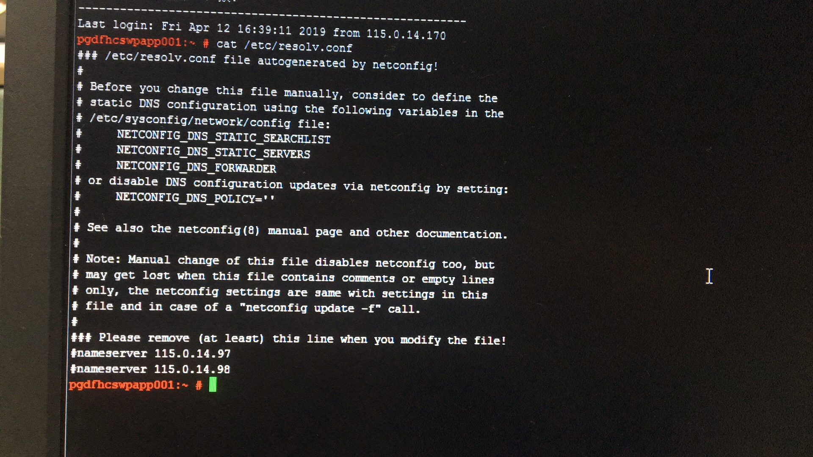
*******************************************************************************
2019/04/12 16:42:27:**吴涛** : 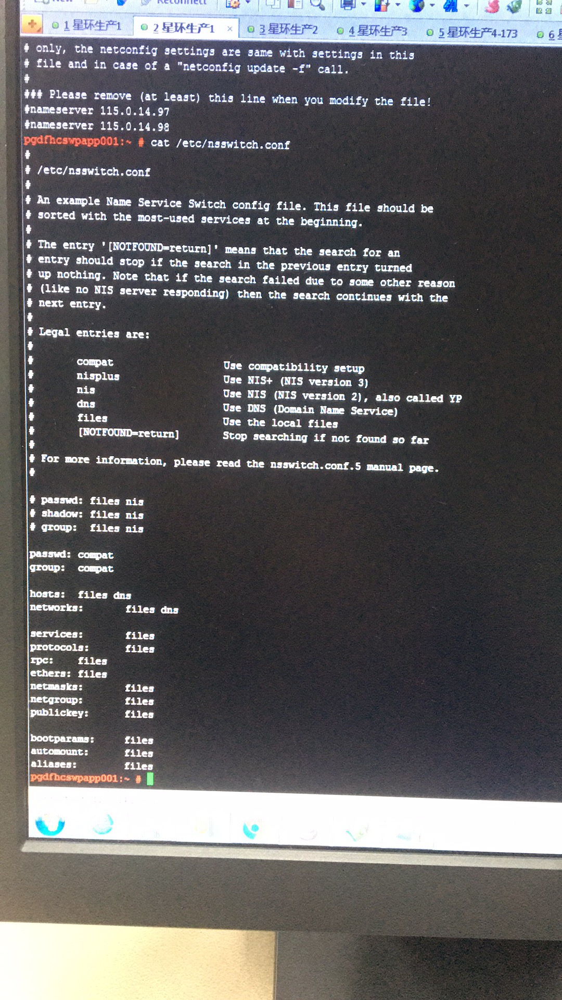
*******************************************************************************
2019/04/12 16:46:57:**吴涛** : 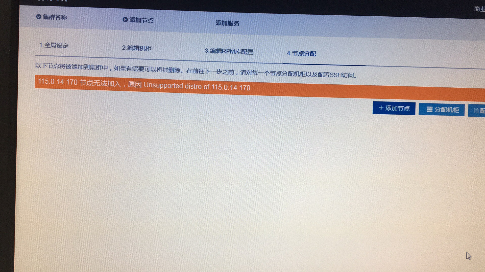
*******************************************************************************
2019/04/12 16:46:58:**何所思** : 页面上的错误是？
*************************************************************************************
2019/04/12 16:48:15:**吴涛** : 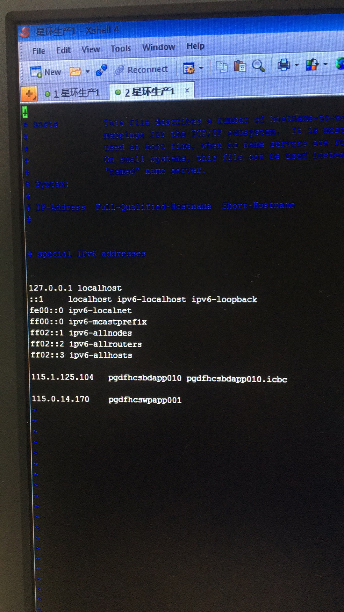
*******************************************************************************
2019/04/12 16:48:22:**吴涛** : 他们的hosts文件比较奇怪
*************************************************************************************
2019/04/12 16:48:28:**吴涛** : 但是我也不敢乱动。。。
*************************************************************************************
2019/04/12 16:52:28:**何所思** : hosts是他们自己配的？
*************************************************************************************
2019/04/12 16:52:28:**徐恒** : hosts是他们自己配的？
*************************************************************************************
2019/04/12 16:52:42:**吴涛** : 嗯
*************************************************************************************
2019/04/12 16:52:42:**吴涛** : 嗯
*************************************************************************************
2019/04/12 16:52:52:**吴涛** : 最后一行是我加的
*************************************************************************************
2019/04/12 16:52:52:**吴涛** : 最后一行是我加的
*************************************************************************************
2019/04/12 16:53:10:**何所思** : 这是虚拟机么？、
*************************************************************************************
2019/04/12 16:53:10:**徐恒** : 这是虚拟机么？、
*************************************************************************************
2019/04/12 16:53:20:**吴涛** : 还有一行172.0.0.2被我删了
*************************************************************************************
2019/04/12 16:53:20:**吴涛** : 还有一行172.0.0.2被我删了
*************************************************************************************
2019/04/12 16:53:21:**吴涛** : 不是
*************************************************************************************
2019/04/12 16:53:21:**吴涛** : 不是
*************************************************************************************
2019/04/12 16:53:25:**吴涛** : 物理机
*************************************************************************************
2019/04/12 16:53:25:**吴涛** : 物理机
*************************************************************************************
2019/04/12 16:53:53:**何所思** : 安装的时候是选择的通过/etc/hosts管理吧？
*************************************************************************************
2019/04/12 16:53:53:**徐恒** : 安装的时候是选择的通过/etc/hosts管理吧？
*************************************************************************************
2019/04/12 16:54:07:**吴涛** : 是的
*************************************************************************************
2019/04/12 16:54:07:**吴涛** : 是的
*************************************************************************************
2019/04/12 16:54:57:**何所思** : 那三个节点都要加到hosts里去
*************************************************************************************
2019/04/12 16:54:57:**徐恒** : 那三个节点都要加到hosts里去
*************************************************************************************
2019/04/12 16:55:25:**吴涛** : 我试试
*************************************************************************************
2019/04/12 16:55:25:**吴涛** : 我试试
*************************************************************************************
2019/04/12 17:00:57:**吴涛** : 还是不行
*************************************************************************************
2019/04/12 17:00:57:**吴涛** : 还是不行
*************************************************************************************
2019/04/12 17:01:09:**吴涛** : 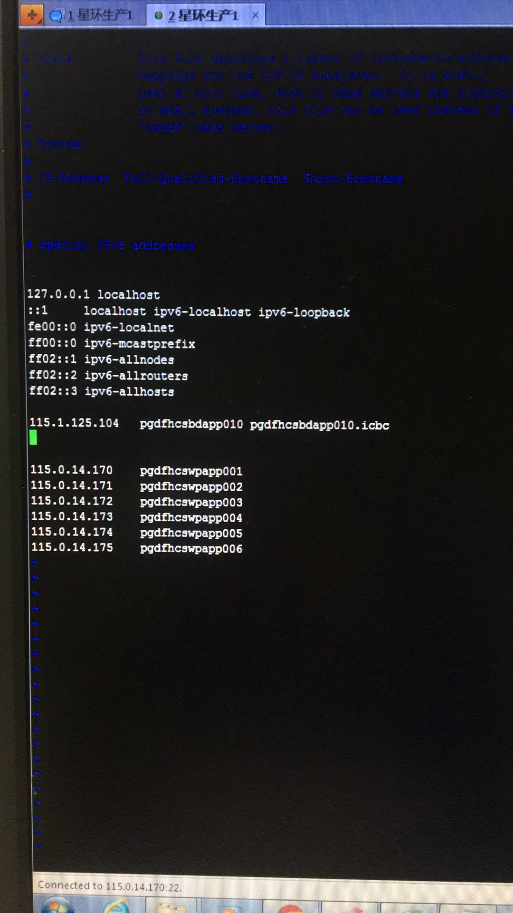
*******************************************************************************
2019/04/12 17:01:09:**吴涛** : 
*******************************************************************************
2019/04/12 17:01:20:**吴涛** : 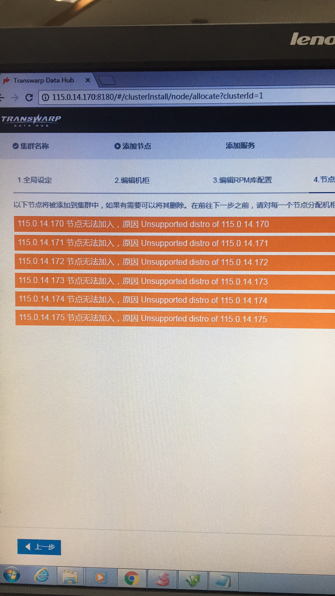
*******************************************************************************
2019/04/12 17:01:20:**吴涛** : 
*******************************************************************************
2019/04/12 17:01:33:**吴涛** : 会不会是ipv6的原因
*************************************************************************************
2019/04/12 17:01:33:**吴涛** : 会不会是ipv6的原因
*************************************************************************************
2019/04/12 17:01:40:**吴涛** : 我看host配置里面写了ipv6
*************************************************************************************
2019/04/12 17:01:40:**吴涛** : 我看host配置里面写了ipv6
*************************************************************************************
2019/04/12 17:04:21:**何所思** : 你用ssh登陆到这个节点上的时候，有显示什么提示信息么？
*************************************************************************************
2019/04/12 17:04:21:**徐恒** : 你用ssh登陆到这个节点上的时候，有显示什么提示信息么？
*************************************************************************************
2019/04/12 17:04:34:**何所思** : 新建个窗口，登陆试试
*************************************************************************************
2019/04/12 17:04:34:**徐恒** : 新建个窗口，登陆试试
*************************************************************************************
2019/04/12 17:06:04:**吴涛** : 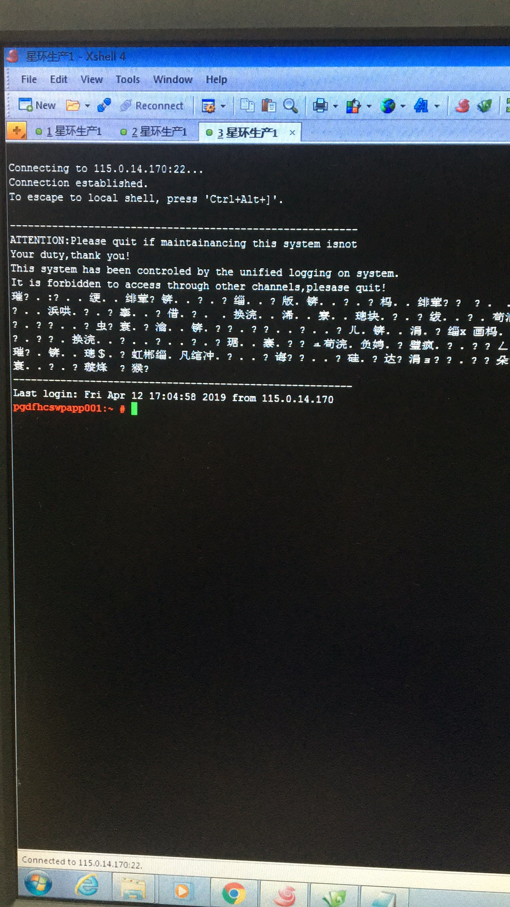
*******************************************************************************
2019/04/12 17:06:04:**吴涛** : 
*******************************************************************************
2019/04/12 17:06:07:**吴涛** : 我搜一下这个乱码怎么处理
*************************************************************************************
2019/04/12 17:06:07:**吴涛** : 我搜一下这个乱码怎么处理
*************************************************************************************
2019/04/12 17:07:10:**吴涛** : 
*******************************************************************************
2019/04/12 17:07:10:**吴涛** : 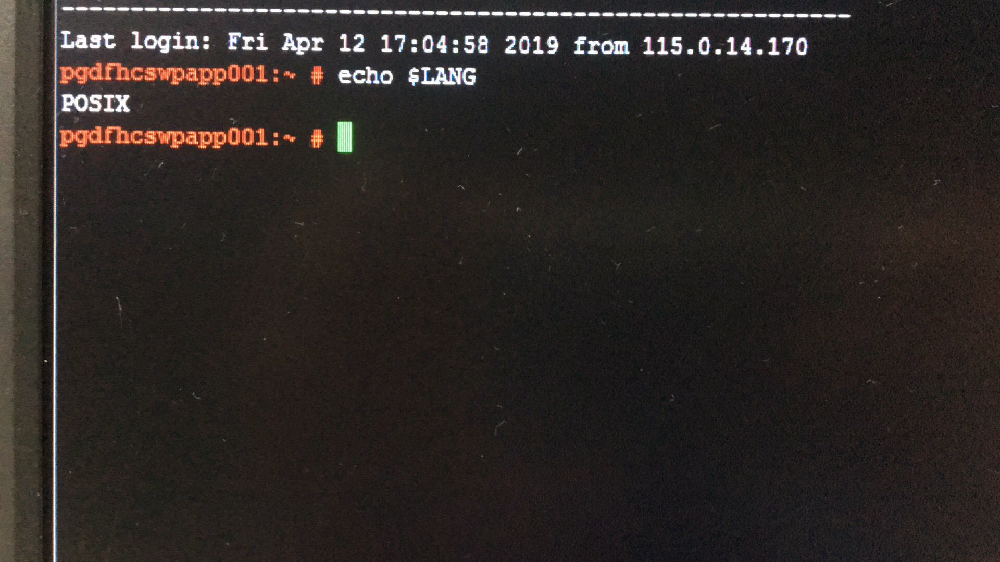
*******************************************************************************
2019/04/12 17:07:59:**吴涛** : 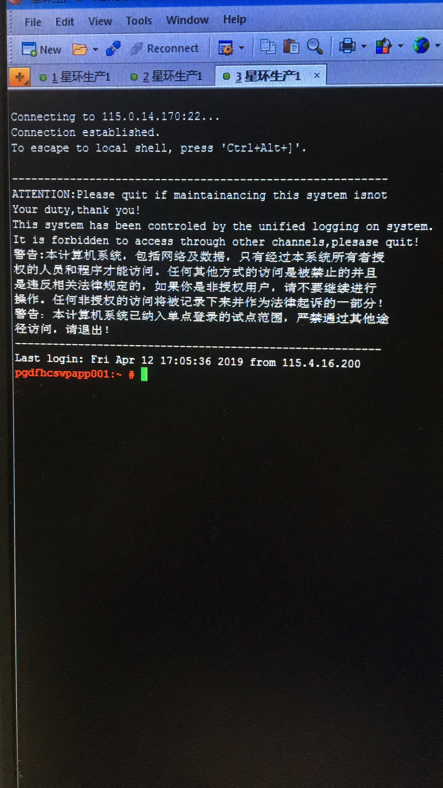
*******************************************************************************
2019/04/12 17:07:59:**吴涛** : 
*******************************************************************************
2019/04/12 17:08:10:**吴涛** : 没有什么异常的信息
*************************************************************************************
2019/04/12 17:08:10:**吴涛** : 没有什么异常的信息
*************************************************************************************
2019/04/12 17:10:26:**何所思** : 
*******************************************************************************
2019/04/12 17:10:26:**徐恒** : 
*******************************************************************************
2019/04/12 17:10:31:**徐恒** : 这个就很异常了
*************************************************************************************
2019/04/12 17:10:31:**何所思** : 这个就很异常了
*************************************************************************************
2019/04/12 17:10:35:**何所思** : 联系客户把
*************************************************************************************
2019/04/12 17:10:35:**徐恒** : 联系客户把
*************************************************************************************
2019/04/12 17:10:42:**何所思** : 把这个去掉
*************************************************************************************
2019/04/12 17:10:42:**徐恒** : 把这个去掉
*************************************************************************************
2019/04/12 17:11:42:**吴涛** : ATIENTION这个信息吗》
*************************************************************************************
2019/04/12 17:11:42:**吴涛** : ATIENTION这个信息吗》
*************************************************************************************
2019/04/12 17:15:08:**徐恒** : 嗯
*************************************************************************************
2019/04/12 17:15:08:**何所思** : 嗯
*************************************************************************************
2019/04/12 17:17:47:**吴涛** : 这东西能确认吗？
*************************************************************************************
2019/04/12 17:17:47:**吴涛** : 这东西能确认吗？
*************************************************************************************
2019/04/12 17:22:46:**徐恒** : 问过研发了，是这个原因
*************************************************************************************
2019/04/12 17:24:37:**吴涛** : 在努力中。。。
*************************************************************************************
