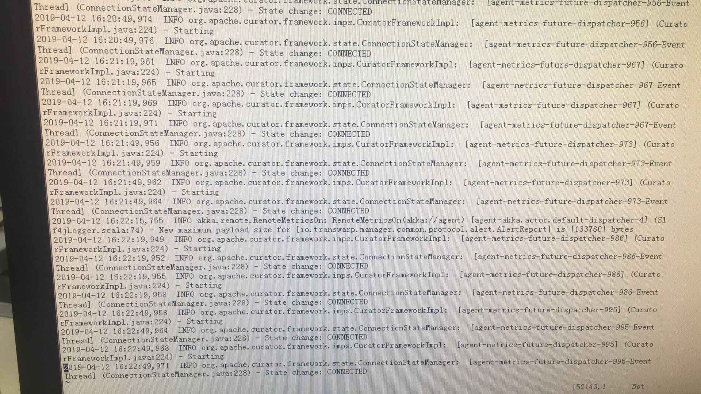

2019/04/12 16:16:36:**小劲松** : 集群有6节点，三个节点64g，24vcores，还有三个节点是125g，40xcores
*************************************************************************************
2019/04/12 16:17:42:**小劲松** : 进程会死掉的两个节点都是64g，24配置的
*************************************************************************************
2019/04/12 16:19:08:**何所思** : 什么版本的集群？
*************************************************************************************
2019/04/12 16:23:22:**小劲松** : 516
*************************************************************************************
2019/04/12 16:24:02:**何所思** : manager主进程也会被杀？
*************************************************************************************
2019/04/12 16:24:14:**小劲松** : 是的
*************************************************************************************
2019/04/12 16:28:03:**小劲松** : 
*******************************************************************************
2019/04/12 16:28:15:**小劲松** : agent死掉的日志
*************************************************************************************
2019/04/12 16:30:24:**小劲松** : 
*******************************************************************************
2019/04/12 16:30:29:**小劲松** : manager死掉的日志
*************************************************************************************
2019/04/12 16:33:42:**何所思** : 日志不能拿出来？
*************************************************************************************
2019/04/12 16:39:29:**小劲松** : 是我没拍好么？
*************************************************************************************
2019/04/12 16:39:38:**小劲松** : 我这边问一下客户先
*************************************************************************************
2019/04/12 17:22:29:**星环彭亮** : [点我进附件](https://github.com/CorkiZhang/itchat-message/tree/master/sla3-881 东莞银行-agent进程莫名被杀死/ATTACHMENT/transwarp-manager.log)
*******************************************************************************
2019/04/12 17:22:39:**星环彭亮** : [点我进附件](https://github.com/CorkiZhang/itchat-message/tree/master/sla3-881 东莞银行-agent进程莫名被杀死/ATTACHMENT/transwarp-manager-agent.log)
*******************************************************************************
2019/04/12 17:27:32:**张石胜** : "徐恒"邀请"算不出流源"加入了群聊
*************************************************************************************
2019/04/12 17:28:11:**何所思** : @算不出流源 超平哥，我又在开会了，这个问题还得麻烦你[撇嘴]
*************************************************************************************
2019/04/12 17:28:28:**何所思** : 他的manager主进程会被杀掉
*************************************************************************************
2019/04/12 17:29:10:**何所思** : @小劲松 再把日志发一次吧
*************************************************************************************
2019/04/12 17:29:41:**小劲松** : [点我进附件](https://github.com/CorkiZhang/itchat-message/tree/master/sla3-881 东莞银行-agent进程莫名被杀死/ATTACHMENT/transwarp-manager.log)
*******************************************************************************
2019/04/12 17:29:41:**小劲松** : [点我进附件](https://github.com/CorkiZhang/itchat-message/tree/master/sla3-881 东莞银行-agent进程莫名被杀死/ATTACHMENT/transwarp-manager-agent.log)
*******************************************************************************
2019/04/12 17:30:04:**小劲松** : agent也会被杀掉，而且restart一会，马上又会死掉
*************************************************************************************
2019/04/12 17:30:55:**算不出流源** : 什么版本
*************************************************************************************
2019/04/12 17:31:01:**小劲松** : 516
*************************************************************************************
2019/04/12 17:31:01:**算不出流源** : 有没有docker  monitor
*************************************************************************************
2019/04/12 17:31:24:**小劲松** : 你看有没有这个包么？
*************************************************************************************
2019/04/12 17:32:25:**小劲松** : 
*******************************************************************************
2019/04/12 17:32:32:**小劲松** : <sysmsg type="revokemsg"><revokemsg><session>14148949472@chatroom</session><oldmsgid>1685956866</oldmsgid><msgid>1015866798413808859</msgid><replacemsg><![CDATA["星环彭亮" 撤回了一条消息]]></replacemsg></revokemsg></sysmsg>
*************************************************************************************
2019/04/12 17:32:39:**算不出流源** : 使用以下命令检查实际运行的docker容器数量
docker-containerd-ctr --address unix:///run/docker/libcontainerd/docker-containerd.sock containers | wc -l 和 docker ps | wc -l
*************************************************************************************
2019/04/12 17:34:32:**小劲松** : 
*******************************************************************************
2019/04/12 17:34:36:**小劲松** : 不一样
*************************************************************************************
2019/04/12 17:34:44:**小劲松** : 上次是一样的
*************************************************************************************
2019/04/12 17:34:58:**小劲松** : 是不是docker monitor死了
*************************************************************************************
2019/04/12 17:35:10:**算不出流源** : 是
*************************************************************************************
2019/04/12 17:35:33:**小劲松** : 我需要怎么做？
*************************************************************************************
2019/04/12 17:38:25:**算不出流源** : 你需要把docker mointor起来  把manager和agent也起来
*************************************************************************************
2019/04/12 17:38:57:**小劲松** : 我发现我的docker-monitor只是1.0.1
*************************************************************************************
2019/04/12 17:39:12:**小劲松** : 貌似不是最新的
*************************************************************************************
2019/04/12 17:39:17:**算不出流源** : 那就更新成最新的吧
*************************************************************************************
