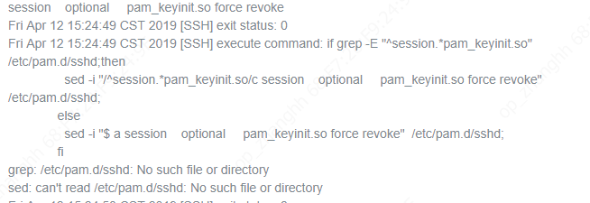
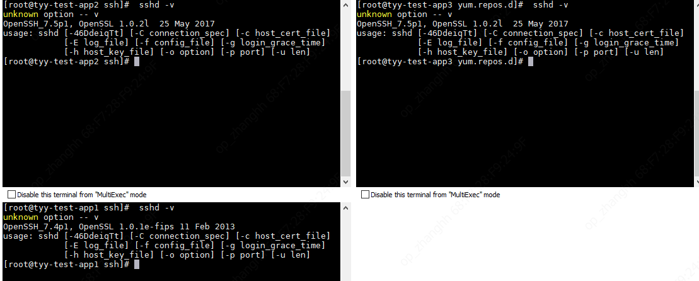

2019/04/12 16:17:33:**小渔父** : 
*******************************************************************************
2019/04/12 16:17:53:**小渔父** : @HUGH-浩 恒浩，具体问题描述你发一下？
*************************************************************************************
2019/04/12 16:18:07:**HUGH-浩** : 新装TDH manager，部署agent的时候，非管理节点报/etc/pam.d/sshd: No such file or directory 。请问可以直接用管理节点的文件放到非管理节点么？s但是sshd安装的情况看着有差异
*************************************************************************************
2019/04/12 16:18:17:**HUGH-浩** : 
*******************************************************************************
2019/04/12 16:18:22:**HUGH-浩** : 
*******************************************************************************
2019/04/12 16:18:58:**小渔父** : @何所思 徐恒
*************************************************************************************
2019/04/12 16:19:59:**HUGH-浩** : 我们有碰过么。TDH6 上一个指令正常exit 0的
*************************************************************************************
2019/04/12 16:20:21:**HUGH-浩** : 
*******************************************************************************
2019/04/12 16:20:25:**HUGH-浩** : sshd安装或者配置时候有问题？
*************************************************************************************
2019/04/12 16:21:05:**SLA福尔摩斯** : "HUGH-浩"邀请"Dong Ming"加入了群聊
*************************************************************************************
2019/04/12 16:23:01:**何所思** : 集群是什么版本？
*************************************************************************************
2019/04/12 16:23:12:**小渔父** : 6.0
*************************************************************************************
2019/04/12 16:23:32:**HUGH-浩** : manager 6
*************************************************************************************
2019/04/12 16:28:57:**何所思** : 这个文件在节点上不存在？
*************************************************************************************
2019/04/12 16:29:07:**HUGH-浩** : en 
*************************************************************************************
2019/04/12 16:30:31:**何所思** : 所有节点都没有？
*************************************************************************************
2019/04/12 16:30:46:**HUGH-浩** : 第一个节点有
*************************************************************************************
2019/04/12 16:32:41:**何所思** : 嗯
*************************************************************************************
2019/04/12 16:32:54:**何所思** : 那其他节点上 sshd -v命令能执行吗？
*************************************************************************************
2019/04/12 16:34:01:**HUGH-浩** : 这个指令都不能跑
*************************************************************************************
2019/04/12 16:34:31:**HUGH-浩** : 
*******************************************************************************
2019/04/12 16:37:33:**何所思** : 操作系统是？
*************************************************************************************
2019/04/12 16:37:43:**HUGH-浩** : centos 7.4
*************************************************************************************
