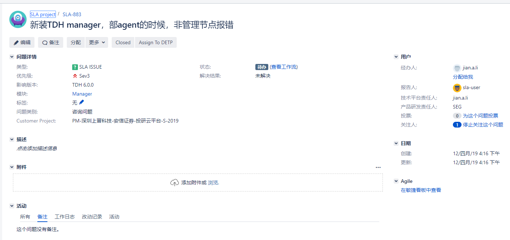
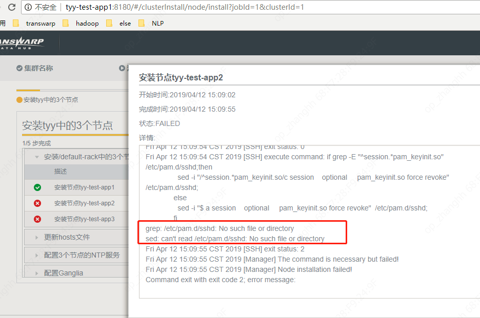
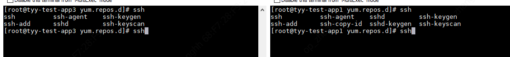

2019/04/12 16:17:33:**小渔父** : 
*******************************************************************************
2019/04/12 16:17:53:**小渔父** : @HUGH-浩 恒浩，具体问题描述你发一下？
*************************************************************************************
2019/04/12 16:18:07:**HUGH-浩** : 新装TDH manager，部署agent的时候，非管理节点报/etc/pam.d/sshd: No such file or directory 。请问可以直接用管理节点的文件放到非管理节点么？s但是sshd安装的情况看着有差异
*************************************************************************************
2019/04/12 16:18:17:**HUGH-浩** : 
*******************************************************************************
2019/04/12 16:18:22:**HUGH-浩** : 
*******************************************************************************
2019/04/12 16:18:58:**小渔父** : @何所思 徐恒
*************************************************************************************
2019/04/12 16:19:59:**HUGH-浩** : 我们有碰过么。TDH6 上一个指令正常exit 0的
*************************************************************************************
