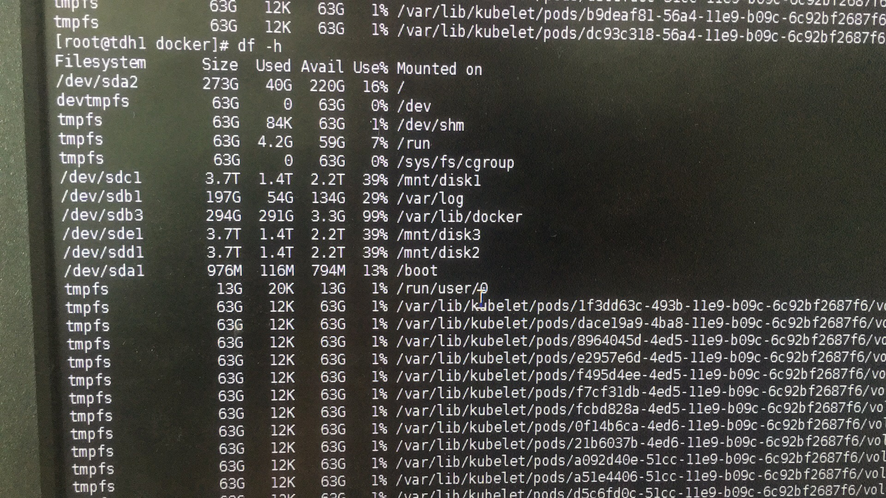
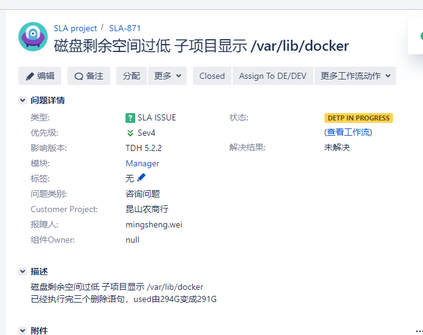
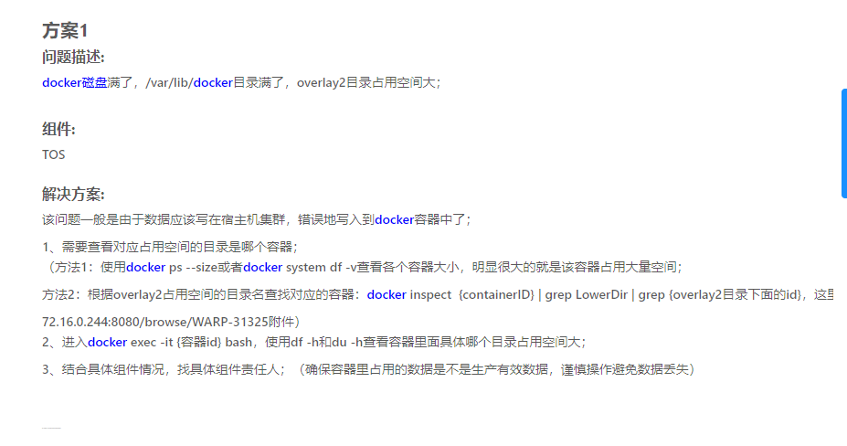

2019/04/12 12:00:39:**张石胜** : @太阳与冰
*************************************************************************************
2019/04/12 12:01:54:**Gavin** : 
*******************************************************************************
2019/04/12 12:02:09:**张石胜** : "Gavin"邀请"HMK"加入了群聊
*************************************************************************************
2019/04/12 12:02:33:**Gavin** : 这是在执行完
*************************************************************************************
2019/04/12 12:02:35:**Gavin** : docker rmi $(docker images --filter "dangling=true" -q --no-trunc)
docker rm -vf $(docker ps -qa --no-trunc --filter "status=exited")
docker volume rm $(docker volume ls -qf dangling=true)
*************************************************************************************
2019/04/12 12:03:10:**Gavin** : 是还需要别的操作吗
*************************************************************************************
2019/04/12 12:03:22:**太阳与冰** : 
*******************************************************************************
2019/04/12 12:04:06:**太阳与冰** : 
*******************************************************************************
2019/04/12 12:04:29:**太阳与冰** : aiops查了么？我昨天刚录的
*************************************************************************************
2019/04/12 12:04:39:**小渔父** : ...
*************************************************************************************
2019/04/12 12:04:48:**张石胜** : "李健"修改群名为“sla4-871docker磁盘满了”
*************************************************************************************
2019/04/12 12:05:02:**张石胜** : "李健"修改群名为“sla4-871昆山农商行docker磁盘满了”
*************************************************************************************
