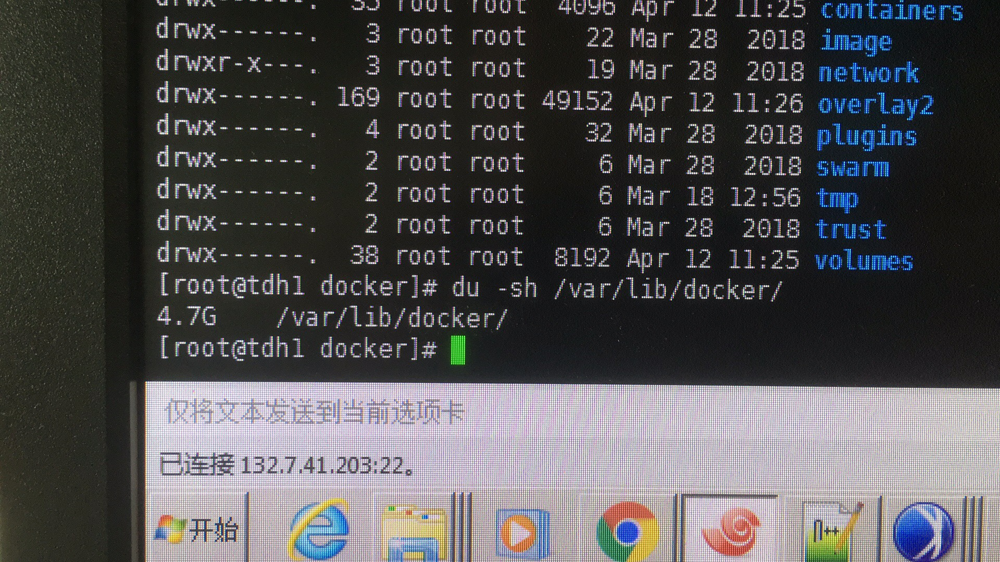

2019/04/12 12:05:23:**Gavin** : 
*******************************************************************************
2019/04/12 12:06:25:**Gavin** : @太阳与冰 查了的，你发的也执行过
*************************************************************************************
2019/04/12 12:07:07:**太阳与冰** : 嗯，那这个是另一个问题
*************************************************************************************
2019/04/12 12:07:13:**太阳与冰** : df -h看一下
*************************************************************************************
2019/04/12 12:07:38:**Gavin** : 
*******************************************************************************
2019/04/12 12:08:57:**太阳与冰** : ls -a 看一下/var/lib/docker
*************************************************************************************
2019/04/12 12:10:10:**Gavin** : 
*******************************************************************************
2019/04/12 12:10:50:**太阳与冰** : du -h也看一下
*************************************************************************************
2019/04/12 12:11:08:**Gavin** : 
*******************************************************************************
2019/04/12 12:11:31:**太阳与冰** : 上面那个用ls -al ，少个l
*************************************************************************************
2019/04/12 12:12:21:**HMK** : 这个问题应该是由删除的文件没有释放空间造成的
*************************************************************************************
2019/04/12 12:12:37:**Gavin** : 
*******************************************************************************
2019/04/12 12:13:19:**太阳与冰** : du -sh /var/lib/docker
*************************************************************************************
2019/04/12 12:14:08:**Gavin** : 
*******************************************************************************
2019/04/12 12:14:30:**太阳与冰** : notice有个[notice]磁盘空间消失
*************************************************************************************
2019/04/12 12:15:41:**Gavin** : ？
*************************************************************************************
2019/04/12 12:15:50:**何所思** : du -h 的结果也是4g么？
*************************************************************************************
2019/04/12 12:17:34:**Gavin** : 是的啊
*************************************************************************************
2019/04/12 12:20:15:**小渔父** : notice邮件上的现象存在么
*************************************************************************************
2019/04/12 12:20:28:**小渔父** : 
*******************************************************************************
2019/04/12 12:20:35:**小渔父** : lsof -n | grep deleted
*************************************************************************************
2019/04/12 12:25:04:**Gavin** : 
*******************************************************************************
2019/04/12 13:17:14:**太阳与冰** : 输出到文件发出来一下
*************************************************************************************
2019/04/12 13:25:51:**Gavin** : 稍等一下
*************************************************************************************
2019/04/12 13:31:56:**HMK** : 
*******************************************************************************
2019/04/12 13:33:09:**HMK** : 并没有发现那个进程占/var lib docker
*************************************************************************************
2019/04/12 13:33:47:**HMK** : 
*******************************************************************************
2019/04/12 13:56:33:**Gavin** : @太阳与冰 
*************************************************************************************
2019/04/12 13:59:02:**HMK** : 
*******************************************************************************
2019/04/12 13:59:20:**HMK** : 
*******************************************************************************
2019/04/12 14:00:18:**HMK** : inceptorserver的锅
*************************************************************************************
2019/04/12 14:00:56:**HMK** : 这个很可能是个Bug哦[捂脸]
*************************************************************************************
2019/04/12 14:03:13:**张石胜** : "李健"邀请"bianyu"加入了群聊
*************************************************************************************
2019/04/12 14:08:37:**太阳与冰** : 
*******************************************************************************
2019/04/12 14:08:38:**太阳与冰** : 
*******************************************************************************
2019/04/12 14:08:39:**太阳与冰** : 
*******************************************************************************
2019/04/12 14:11:35:**太阳与冰** : @bianyu 雨神，情况是这样的，/var/lib/docker盘使用df -h发现占用空间满，实际进去该目录并未发现有文件占用大量空间；（按照之前notice邮件发出来的“磁盘空间消失”并未找到有进程占用句柄没有释放的情况）
*************************************************************************************
2019/04/12 14:14:55:**bianyu** : filebeat 问题. 稍等
*************************************************************************************
2019/04/12 14:15:11:**bianyu** : 是TDC么?
*************************************************************************************
2019/04/12 14:15:45:**bianyu** : 有milano么?
*************************************************************************************
2019/04/12 14:16:06:**Gavin** : 没有啊，只有tdh
*************************************************************************************
2019/04/12 14:16:42:**bianyu** : ps -ef | grep filebeat
*************************************************************************************
2019/04/12 14:17:14:**Gavin** : 刚重启了inceptor，正常了
*************************************************************************************
2019/04/12 14:17:53:**Gavin** : 客户这边测试比较急，所以。
*************************************************************************************
2019/04/12 14:18:09:**Gavin** : 
*******************************************************************************
2019/04/12 14:18:44:**Gavin** : 
*******************************************************************************
2019/04/12 14:19:28:**bianyu** : 31214 进程是什么进程?
*************************************************************************************
2019/04/12 14:20:16:**HMK** : @太阳与冰 李健，你误导雨神了[捂脸]
*************************************************************************************
2019/04/12 14:20:38:**bianyu** : 那个贴图里面的 lsof 命令查了么？
*************************************************************************************
2019/04/12 14:20:41:**HMK** : 那个是参考的Wiki也页上的截图
*************************************************************************************
2019/04/12 14:20:43:**太阳与冰** : 
*******************************************************************************
2019/04/12 14:21:10:**bianyu** : 有没有 /var/lib/docker下面文件 deleted 
*************************************************************************************
2019/04/12 14:21:18:**HMK** : 
*******************************************************************************
2019/04/12 14:21:27:**太阳与冰** : 没有的
*************************************************************************************
2019/04/12 14:21:28:**HMK** : 
*******************************************************************************
2019/04/12 14:24:53:**太阳与冰** : 魁，lsof这个你是重启inceptor之前执行的吧？
*************************************************************************************
2019/04/12 14:25:48:**bianyu** : 
*******************************************************************************
2019/04/12 14:26:43:**HMK** : 是的
*************************************************************************************
2019/04/12 14:27:30:**Gavin** : 
*******************************************************************************
2019/04/12 14:27:36:**bianyu** : 图上面的命令你再执行一遍
*************************************************************************************
2019/04/12 14:27:36:**Gavin** : 现在是没有的
*************************************************************************************
2019/04/12 14:30:05:**HMK** : @太阳与冰 @bianyu 已经通过重启inceptor释放空间了
*************************************************************************************
2019/04/12 14:31:26:**HMK** : 我们平台不能用，测试工作没有办法继续，这个问题只能后面遇到再跟了[捂脸]
*************************************************************************************
2019/04/12 14:36:02:**bianyu** : 已经释放了?
*************************************************************************************
2019/04/12 14:36:14:**bianyu** : 那还查什么 [捂脸]
*************************************************************************************
2019/04/12 14:36:45:**bianyu** : 刚才的 lsof 是释放之前执行的还是释放之后执行的?
*************************************************************************************
2019/04/12 14:37:38:**Gavin** : 后
*************************************************************************************
2019/04/12 14:37:53:**太阳与冰** : [捂脸]
*************************************************************************************
2019/04/12 14:38:25:**Gavin** : 
*******************************************************************************
2019/04/12 14:38:37:**Gavin** : 之前的已经导出到一个文件中
*************************************************************************************
2019/04/12 14:39:52:**太阳与冰** : 发一下
*************************************************************************************
2019/04/12 14:40:14:**Gavin** : 发出来吗
*************************************************************************************
2019/04/12 14:40:19:**太阳与冰** : 嗯嗯
*************************************************************************************
2019/04/12 14:40:20:**Gavin** : 稍等下
*************************************************************************************
