2019/04/12 11:17:58:**李尤京** : @刘宁 
*************************************************************************************
2019/04/12 11:19:31:**刘宁** : curl -X GET https://${your ip}:5000/v2/transwarp/sophon-web/tags/list
*************************************************************************************
2019/04/12 11:20:42:**刘宁** : @邹波 kubectl get po | grep api 看看Pod有没有启动
*************************************************************************************
2019/04/12 11:20:52:**李尤京** : 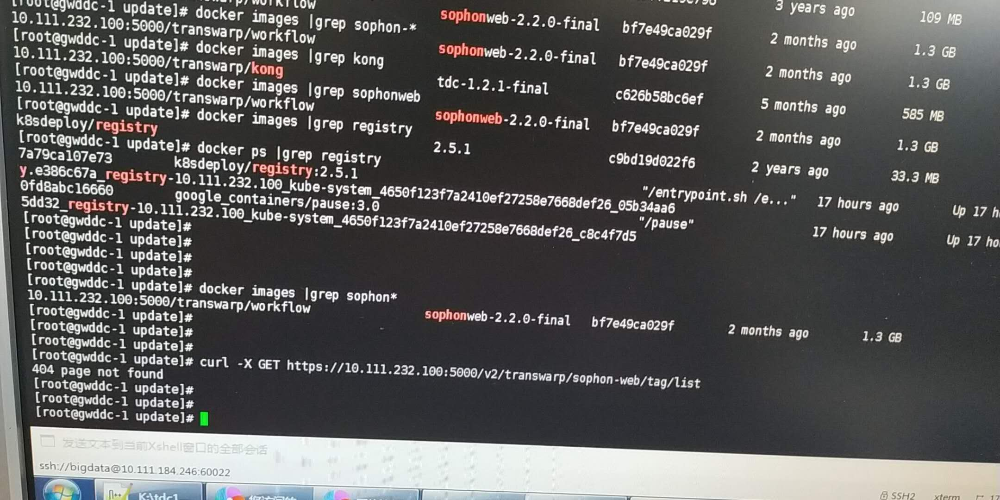
*******************************************************************************
2019/04/12 11:21:15:**李尤京** : 404，看起来是没有image😂
*************************************************************************************
2019/04/12 11:21:35:**刘宁** : curl -X GET https://${your ip}:5000/v2/_catalog | grep sophon
*************************************************************************************
2019/04/12 11:21:57:**李尤京** : 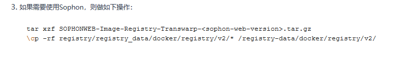
*******************************************************************************
2019/04/12 11:22:33:**李尤京** : 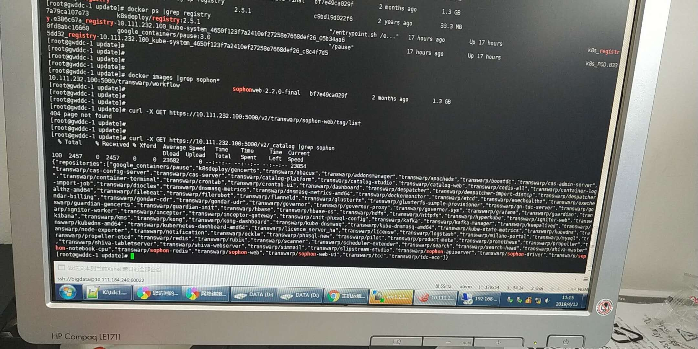
*******************************************************************************
2019/04/12 11:26:14:**刘宁** : 直接在sla那个群里讨论吧，我也在那个群
*************************************************************************************
2019/04/12 11:26:48:**李尤京** : 能拉一下嘛？
*************************************************************************************
2019/04/12 11:27:04:**李尤京** : 是回我嘛？😂
*************************************************************************************
2019/04/12 11:27:31:**陈炜** : 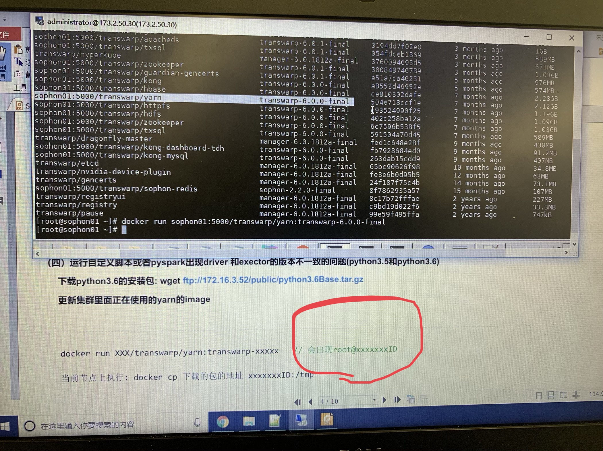
*******************************************************************************
2019/04/12 11:27:33:**刘宁** : 哎？昨天不是你问的呀
*************************************************************************************
2019/04/12 11:27:51:**刘宁** : @李尤京 是中联油TDC部署么?
*************************************************************************************
2019/04/12 11:27:53:**陈炜** : 请问，按照提示没有那个id啊
*************************************************************************************
2019/04/12 11:28:23:**刘宁** : docker run -it ${image} bash
*************************************************************************************
2019/04/12 11:28:27:**李尤京** : 不是的。。
*************************************************************************************
2019/04/12 11:28:57:**李尤京** : [囧]这边是国网电动汽车
*************************************************************************************
2019/04/12 11:29:47:**刘宁** : ok, 我现在怀疑包是不是不对，我看看
*************************************************************************************
2019/04/12 11:30:24:**李尤京** : 好的，谢谢
*************************************************************************************
2019/04/12 11:30:42:**陈炜** : @刘宁 看到了，谢谢
*************************************************************************************
2019/04/12 11:32:49:**刘宁** : @李尤京 md5值是?
*************************************************************************************
2019/04/12 11:34:26:**李尤京** : 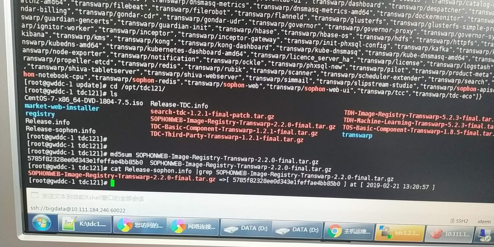
*******************************************************************************
2019/04/12 11:35:15:**刘宁** : 看起来是正确的
*************************************************************************************
2019/04/12 11:35:28:**刘宁** : 你那边能tv吗？
*************************************************************************************
2019/04/12 11:35:41:**李尤京** : 嗯，安装的时候已经校对了。
*************************************************************************************
2019/04/12 11:35:47:**李尤京** : 不能tv
*************************************************************************************
2019/04/12 11:36:05:**刘宁** : 感觉需要问下夏明，先加个好友
*************************************************************************************
2019/04/12 11:36:32:**陈夏明** : 你到registry目录下看看原始数据
*************************************************************************************
2019/04/12 11:37:00:**陈夏明** : /registry-data/docker/registry/v2/
*************************************************************************************
2019/04/12 11:38:07:**李尤京** : 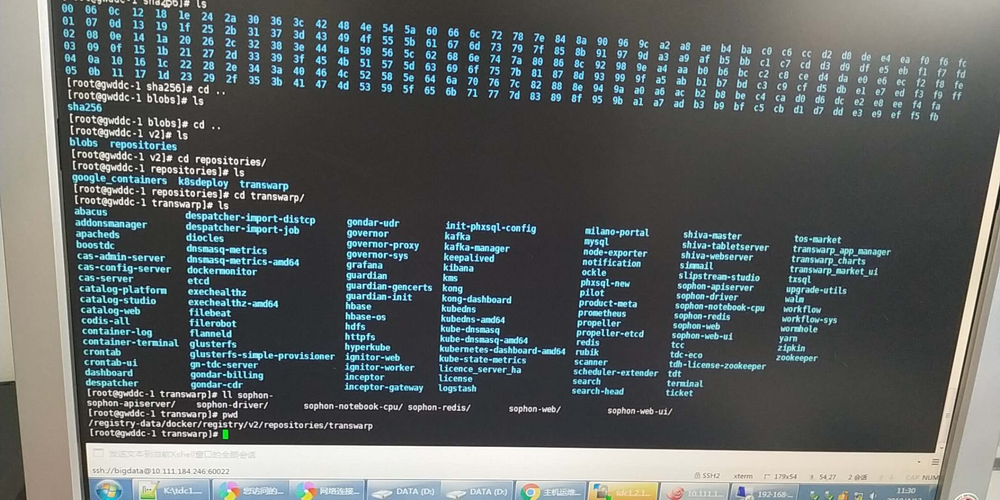
*******************************************************************************
2019/04/12 11:38:50:**陈夏明** : 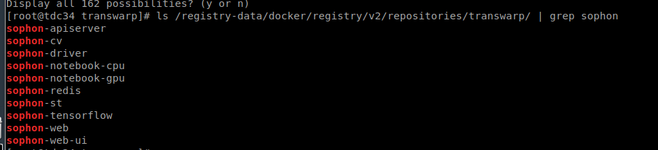
*******************************************************************************
2019/04/12 11:39:50:**李尤京** : 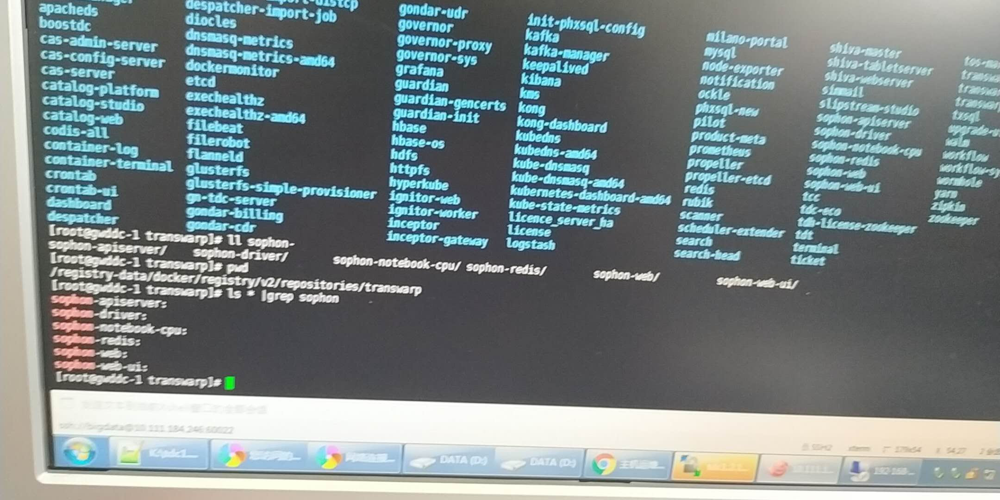
*******************************************************************************
2019/04/12 11:40:28:**陈夏明** : docker info看下
*************************************************************************************
2019/04/12 11:40:49:**李尤京** : 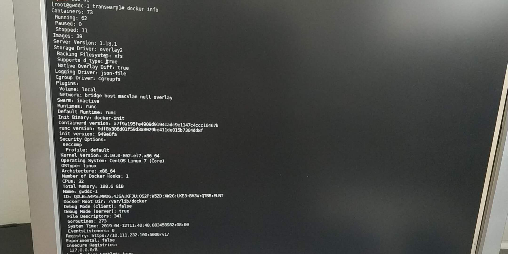
*******************************************************************************
2019/04/12 11:42:36:**陈夏明** : 10.111.232.100是你所在的这个节点吗
*************************************************************************************
2019/04/12 11:43:27:**李尤京** : 嗯嗯，是的
*************************************************************************************
2019/04/12 11:47:44:**陈夏明** : ls /registry-data/docker/registry/v2/repositories/transwarp/sophon-redis/_manifests/tags/
*************************************************************************************
2019/04/12 11:47:48:**陈夏明** : 看下这个目录下tag
*************************************************************************************
2019/04/12 11:47:59:**陈夏明** : docker pull 10.111.232.100:5000/transwarp/sophon-redis:sophonweb-2.2.0-final
*************************************************************************************
2019/04/12 11:48:05:**陈夏明** : 看下这个反馈
*************************************************************************************
2019/04/12 11:49:21:**李尤京** : 好的，稍等
*************************************************************************************
2019/04/12 11:50:33:**李尤京** : 在pull
*************************************************************************************
2019/04/12 11:50:43:**李尤京** : 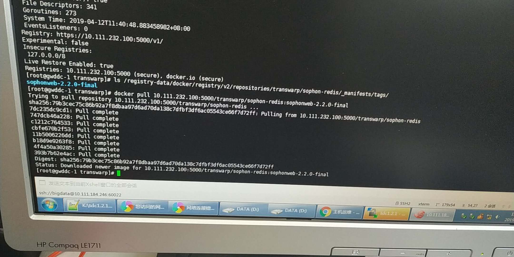
*******************************************************************************
2019/04/12 11:50:48:**刘宁** : 在Pull就说明有
*************************************************************************************
2019/04/12 11:51:37:**李尤京** : 对，那界面上安装怎么会找不到redis呢？？
*************************************************************************************
2019/04/12 11:56:05:**陈夏明** : 这个集群是哪个版本？升级上来的吗
*************************************************************************************
2019/04/12 11:56:28:**李尤京** : 新安装的tdc121
*************************************************************************************
2019/04/12 11:56:59:**陈夏明** : 之前是1.2.0吗
*************************************************************************************
2019/04/12 11:57:16:**李尤京** : 不是的，第一次安装部署。。
*************************************************************************************
2019/04/12 11:58:46:**陈夏明** : 那应该不是数据缓存的问题，我只能怀疑是registry服务配置。。
*************************************************************************************
2019/04/12 11:58:53:**陈夏明** : 看下ockle instance 的registry地址
*************************************************************************************
2019/04/12 11:58:58:**陈夏明** : 在tdcsys下
*************************************************************************************
2019/04/12 11:59:09:**李尤京** : 好
*************************************************************************************
2019/04/12 12:00:37:**李尤京** : 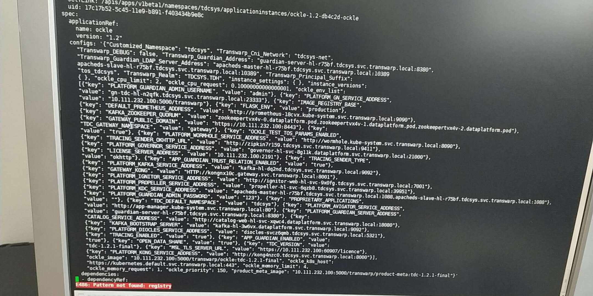
*******************************************************************************
2019/04/12 12:00:53:**李尤京** : 没找到registry配置？
*************************************************************************************
2019/04/12 12:03:45:**陈夏明** : 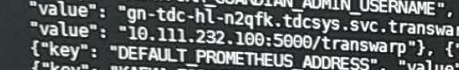
*******************************************************************************
2019/04/12 12:03:47:**陈夏明** : 配置对的
*************************************************************************************
2019/04/12 12:04:06:**陈夏明** : 你再请求部署一次，把propeller的日志存成文件，放出来
*************************************************************************************
2019/04/12 12:04:10:**李尤京** : registry服务配置问题？？我这边数仓的云产品已经安装成功了。
*************************************************************************************
2019/04/12 12:04:09:**陈夏明** : 在tdcsys下
*************************************************************************************
2019/04/12 12:04:40:**李尤京** : 好。
*************************************************************************************
2019/04/12 12:05:07:**陈夏明** : 如果你是先装tdc，在补齐sophon镜像，需要更新propeller缓存
*************************************************************************************
2019/04/12 12:05:08:**陈夏明** : 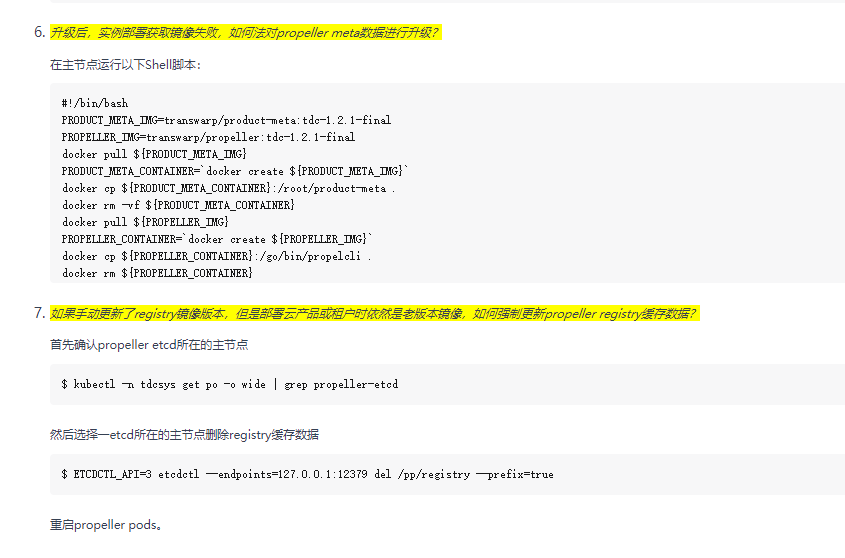
*******************************************************************************
2019/04/12 12:06:56:**陈夏明** : 你更新下缓存，再部署sophon，如果还报错，把propeller的日志捞出来，放到tdc支持群追吧
*************************************************************************************
2019/04/12 12:07:19:**李尤京** : 好的，谢谢陈博
*************************************************************************************
2019/04/12 12:08:11:**陈夏明** : 客气了
*************************************************************************************
2019/04/12 12:10:32:**李尤京** : 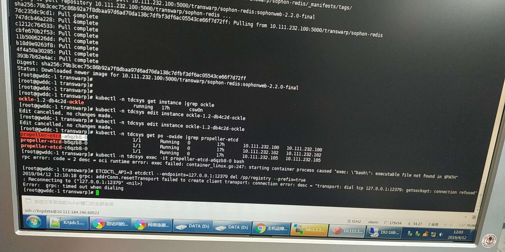
*******************************************************************************
2019/04/12 12:10:45:**李尤京** : 第二条删除命令有问题？
*************************************************************************************
2019/04/12 12:11:58:**李尤京** : @陈夏明 
*************************************************************************************
2019/04/12 12:13:34:**陈夏明** : 你换102或105再试试，服务状态看起来没问题
*************************************************************************************
2019/04/12 12:14:58:**李尤京** : 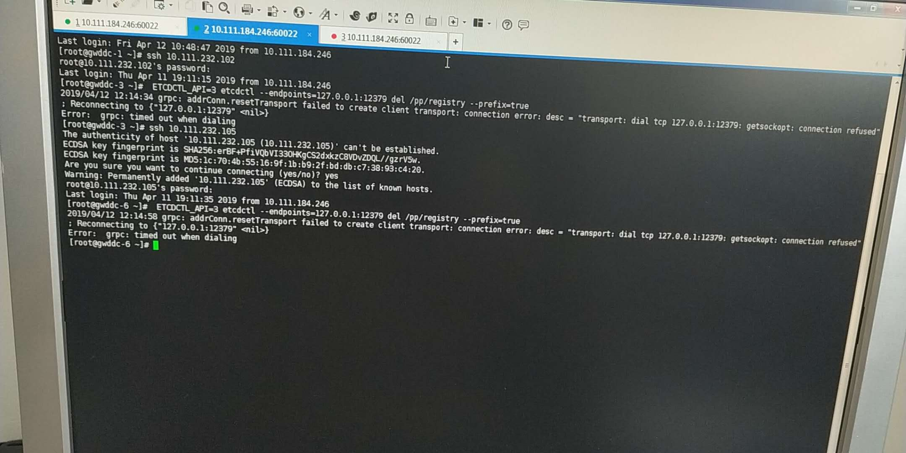
*******************************************************************************
2019/04/12 12:15:10:**李尤京** : 没有一个节点能执行这条命令😂
*************************************************************************************
2019/04/12 12:15:57:**李尤京** : 是要在某个目录下执行嘛？？
*************************************************************************************
2019/04/12 13:26:14:**陈夏明** : 转到tdc支持群里让月星帮你看一下吧
*************************************************************************************
2019/04/12 15:22:05:**陆增翔** : 上海VPN 连不上了
*************************************************************************************
2019/04/12 15:25:37:**陆增翔** : 有能连上的同事嘛？
*************************************************************************************
2019/04/12 15:27:14:**刘宁** : 连不到公司的VPN?
*************************************************************************************
2019/04/12 15:27:30:**陆增翔** : 对
*************************************************************************************
2019/04/12 15:27:38:**陆增翔** : 昨天晚上还能连
*************************************************************************************
2019/04/12 15:27:58:**陆增翔** : 现在连上了
*************************************************************************************
2019/04/12 15:28:20:**陆增翔** : 刚刚一直连不上，谢谢啦
*************************************************************************************
2019/04/12 15:29:40:**陈炜** : 请问notebook使用pyspark核时，是默认启动的cluster模式么？可以local 模式和cluster 模式进行切换么？
*************************************************************************************
2019/04/12 15:41:05:**刘宁** : @陈炜 默认yarn-client, 和sophon保持一致。
*************************************************************************************
2019/04/12 15:41:07:**刘铖** : 这个没配repo吧
*************************************************************************************
2019/04/12 15:41:49:**李尤京** : 默认repo下载不了，自己搭建的repo出现上面那个。。
*************************************************************************************
2019/04/12 15:41:48:**刘铖** : 我看找的依赖包有缺失
*************************************************************************************
2019/04/12 15:41:58:**郭卓异** : 这些包 就是 os的repo
*************************************************************************************
2019/04/12 15:42:20:**郭卓异** : 搭瓷了
*************************************************************************************
2019/04/12 15:42:39:**李尤京** : 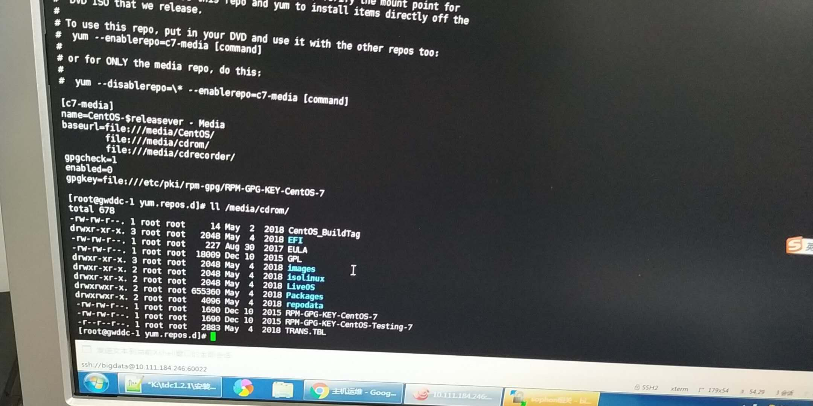
*******************************************************************************
2019/04/12 15:42:47:**陈炜** : @刘宁 好的，谢谢
*************************************************************************************
2019/04/12 15:44:17:**李尤京** : 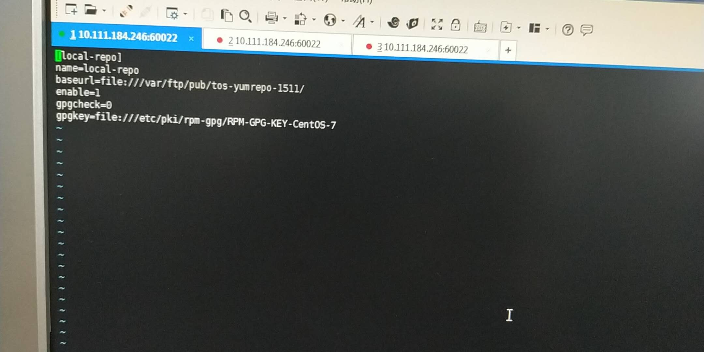
*******************************************************************************
2019/04/12 15:44:28:**郭卓异** : @李尤京 你搜搜看呢
*************************************************************************************
2019/04/12 15:44:37:**李尤京** : tdc自带的7.2的源，但是好像安装不了
*************************************************************************************
2019/04/12 16:55:23:**尤鸿昌** : 
*******************************************************************************
2019/04/12 16:56:35:**尤鸿昌** : @陆天明 天明，中行上海分行的，昨天刚更新过sophon_web
*************************************************************************************
2019/04/12 17:03:09:**刘宁** : 现在是什么状态？
*************************************************************************************
2019/04/12 17:03:41:**刘宁** : 印象里昨天换了前端的image，然后选择属性的弹框修复了。
*************************************************************************************
2019/04/12 17:03:44:**刘宁** : 后面呢?
*************************************************************************************
2019/04/12 17:04:20:**尤鸿昌** : 
*******************************************************************************
2019/04/12 17:04:28:**尤鸿昌** : 昨天登陆正常  
*************************************************************************************
2019/04/12 17:04:29:**杨浩** : 只换了sophon-web-ui，那个sophon-web的镜像回退回去了
*************************************************************************************
2019/04/12 17:04:43:**杨浩** : 昨天可以用，今天就报错了
*************************************************************************************
2019/04/12 17:04:54:**杨浩** : 今天就进不去了
*************************************************************************************
2019/04/12 17:05:02:**尤鸿昌** : 这transport是什么情况  客户这边没用这个组件
*************************************************************************************
2019/04/12 17:05:10:**杨浩** : <sysmsg type="revokemsg"><revokemsg><session>6910301902@chatroom</session><oldmsgid>1685956645</oldmsgid><msgid>6946335192700429277</msgid><replacemsg><![CDATA["杨浩" 撤回了一条消息]]></replacemsg></revokemsg></sysmsg>
*************************************************************************************
2019/04/12 17:05:35:**陆天明** : sophon不能起来吗？ @尤鸿昌
*************************************************************************************
2019/04/12 17:06:16:**尤鸿昌** : 是的   起不来
*************************************************************************************
2019/04/12 17:08:31:**杨浩** : 
*******************************************************************************
2019/04/12 17:09:20:**杨浩** : 后台显示是running，但是网页不能访问
*************************************************************************************
